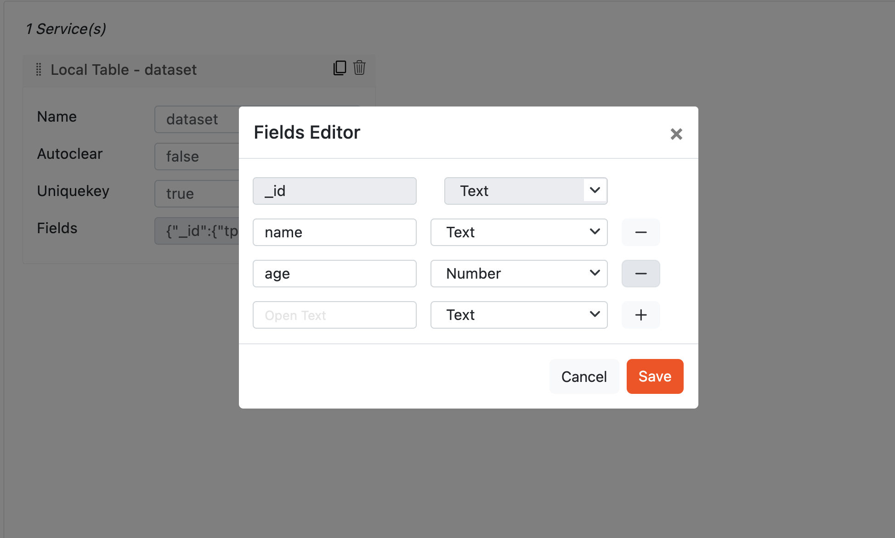
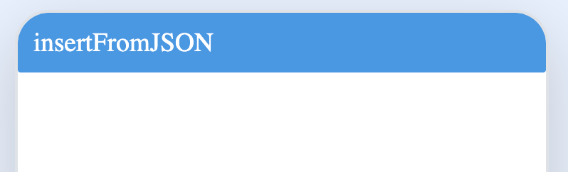
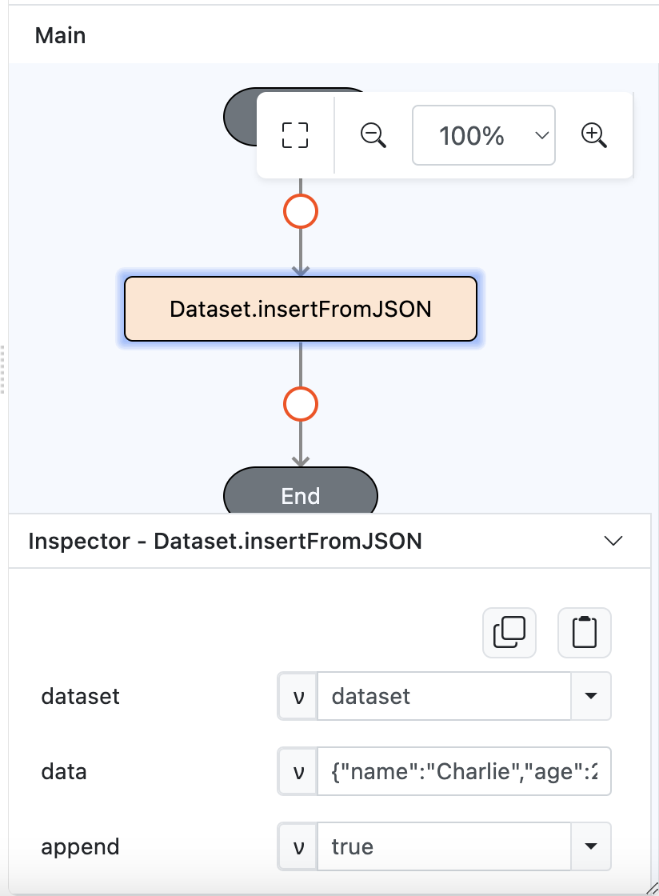

# Dataset.insertFromJSON

## Description

Inserts data from JSON into a dataset. Supports both single and multiple entries with options for appending data.

## Input / Parameter

| Name | Description | Input Type | Default | Options | Required |
| ------ | ------ | ------ | ------ | ------ | ------ |
| dataset | The name of the dataset that is created in Services. | Text | - | - | Yes |
| data | Single or multiple dynamic attributes with values associated with each attribute. | Text/List of Text | - | - | Yes |
| append | Boolean flag to indicate if the new data should be appended to the existing dataset or replace it. | Boolean | - | true/false | Yes |
| extra | The stored value that is passed to all the callbacks. | Any | - | - | No |

## Output

| Description | Output Type |
| ------ | ------ |
| Returns the formatted information. | Object |

### Object

| Key | Description | Output Type |
| ------ | ------ | ------ |
| success | Boolean value to denote whether the function was executed successfully. | Text |
| message | The message to print. | Text |
| data | Any additional message or data to print. | Text |

## Callback

### callback

The action performed if this function runs successfully.

| Description | Output Type |
| ------ | ------ |
| Returns the newly created or updated data. | Object |

### errorCallback

The action performed if this function does not run successfully.

| Description | Output Type |
| ------ | ------ |
| Returns an error message. | Text |

## Example

In this example, we will insert data from a JSON object into a table in the local storage. This can be either a single entry or multiple entries.

### Steps

1. Drag a `Local Table` component into the services panel on the service page and fill in the fields. For `fields` field, add `name` and `age` as object keys with Text type.

    

        
    

2. Drag a button component to a page in the mobile designer.

    

        
    

3. Select the event `press` and drag the `Dataset.insertFromJSON` function to the event flow and fill in the parameter. For the `data` parameter, put a string of object. For example, {"name":"Charlie","age":20}/[{"name":"Charlie","age":20},{"name":"Charlie2","age":21}] (for multiple values) as their respective values.

    

        
    

4. Toggle the `append` flag based on whether you want to append the new data to the existing dataset or replace everything with the new data.

### Result

1. The new data will be stored in local storage as either a single entry or multiple entries depending on the input.
2. You can verify the dataset in the services panel to confirm that the entries have been added correctly.
