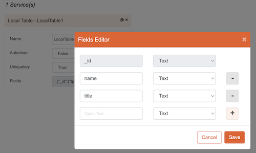
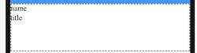
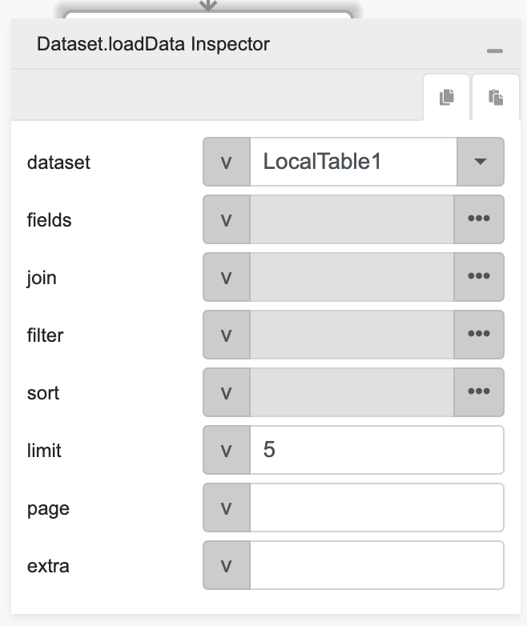

# loadData

## Description

Loads the data from a local table, staging database or 3rd party connector.

## Input / Parameter

| Name    | Description                                                                       | Input Type | Default | Options | Required |
|---------|-----------------------------------------------------------------------------------|------------|---------|---------|----------|
| dataset | The name of the local table to load data from.                                    | String/Text| -       | -       | Yes      |
| fields  | Specifies which fields to retrieve from the local table.                          | Array/List | -       | -       | No       |
| join    | Details about any tables to be joined with the primary dataset for data retrieval.| Array/List | -       | -       | No       |
| filter  | The filters for the fields and values to retrieve.                                | Array/List | -       | -       | Yes      |
| sort    | Specifies the field and direction for sorting the returned data.                  | Array/List | -       | -       | No       |
| limit   | The number of records to be returned from the local table.                        | Number     | -       | -       | No       |
| page    | The page number for pagination purposes.                                          | Number     | -       | -       | No       |
| extra   | Extra parameters stored and passed to callback.  

## Output

| Description | Output Type |
| ------ | ------ |
| Returns the formatted information. | Object |

### Object

| Key | Description | Output Type |
| ------ | ------ | ------ |
| success | Boolean value to denote whether the function was executed successfully. | Text |
| message | The message to print. | Text |
| data | Any additional message or data to print. | Text |

## Callback

### callback

The function to be executed if the records are loaded successfully.

### errorCallback

The function to be executed if the records are not loaded successfully.

## Example

The user wants to load the data from `Local Table` to be used in a flatlist component, (this example will only works after the user has created the data using `Dataset.insert` function).

<!-- Share a scenario, like a user requirements. -->

### Steps

| No. | Description |  |
| ------ | ------ | ------ |
| 1. |  | Make sure the `Local Table` component that's being used in `Dataset.insert` function example is exist and filled on the services panel in the service page. |
| 2. |  | Drag a button component to a page in the mobile designer. |
| 3. |  | Drag a flatlist component to a page in the mobile designer, and drag a label component into the newly created flatlist component. |
| 4. |  | Fill the flatlist component property in the page and fill the label component property in the flatlist component, make sure the label component field value match with the key of the data that being stored in the local storage. |
| 5. |  | Select the event `press` and drag the `Dataset.loadData` function to the event flow and fill in the parameter. |
| 6. |  | Open the preview and try to press the Button, the flatlist component should display the data from local storage. |

<!-- Show the steps and share some screenshots.

1. .....

Format:  -->

### Result

Should be able to load the data from local storage and display it on flalist component.