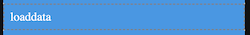

# loadData

## Description

Loads the data from a local table, staging database or 3rd party connector.

## Input / Parameter

| Name | Description | Input Type | Default | Options | Required |
| ------ | ------ | ------ | ------ | ------ | ------ |
| dataset | The name of the local table to load data from. | Text | - | - | Yes |
| fields | Specifies which fields to retrieve from the local table. | List | - | - | No |
| join | Details about any tables to be joined with the primary dataset for data retrieval. | Array/List | - | - | No |
| filter | The filters for the fields and values to retrieve. | List | - | - | Yes |
| sort | Specifies the field and direction for sorting the returned data. | List | - | - | No |
| limit | The number of records to be returned from the local table. | Number | - | - | No |
| page | The page number for pagination purposes. | Number | - | - | No |
| extra | Extra parameters stored and passed to callback. | Any | - | - | No |

## Output

| Description | Output Type |
| ------ | ------ |
| Returns the formatted information. | Object |

### Object

| Key | Description | Output Type |
| ------ | ------ | ------ |
| success | Boolean value to denote whether the function was executed successfully. | Text |
| message | The message to print. | Text |
| data | Any additional message or data to print. | Text |

## Callback

### callback

The function to be executed if the records are loaded successfully.

### errorCallback

The function to be executed if the records are not loaded successfully.

## Example

In this example, we will load the data from the Local Table and display it in a flatlist component.

```js
Note: This example will only work after the user has created the data using `Dataset.insert` function.
```

### Steps

1. Make sure a `Local Table` component is created and filled on the services panel in the service page.

    <div style="display:flex; align-items:center; justify-content:center; background-color: #E7F1FF;">
        
    </div>

2. Drag a button component to a page in the mobile designer.

    <div style="display:flex; align-items:center; justify-content:center; background-color: #E7F1FF;">
        
    </div>

3. Drag a `flatlist` component to a page in the mobile designer, and drag a `label` component into the `flatlist` component.

    <div style="display:flex; align-items:center; justify-content:center; background-color: #E7F1FF;">
        
    </div>

4. Fill the `flatlist` component property in the page and fill the `label` component property in the `flatlist` component, make sure the `label` component `field` value matches the key of the data that is being stored in the local table.

    <div style="display:flex; align-items:center; justify-content:center; background-color: #E7F1FF;">
        
    </div>

5. Select the event `press` and drag the `Dataset.loadData` function to the event flow. Fill in the parameters of the function.

    <div style="display:flex; align-items:center; justify-content:center; background-color: #E7F1FF;">
        
    </div>

### Result

1. The data should be loaded from the local table and displayed in the flalist component.