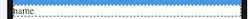

# loadNext

## Description

Loads the subsequent records in a dataset after loadData function was run.

## Input / Parameter

| Name | Description | Input Type | Default | Options | Required |
| ------ | ------ | ------ | ------ | ------ | ------ |
| dataset | The name of the local table to be loaded. | String/Text | - | - | Yes |

## Output

| Description | Output Type |
| ------ | ------ |
| Returns the formatted information. | Object |

### Object

| Key | Description | Output Type |
| ------ | ------ | ------ |
| success | Boolean value to denote whether the function was executed successfully. | Text |
| message | The message to print. | Text |
| data | Any additional message or data to print. | Text |

## Callback

### beforeCallback

The function to be executed if the subsequent records are loaded successfully.

## Example

The user wants to load the next batch of data from `Local Table` to be used in a flatlist component, (this example will only works after the user has created the data using `Dataset.insert` function).

### Steps

1. Make sure the `Local Table` component that's being used in `Dataset.insert` function example is exist and filled on the services panel in the service page.

    

        
    

2. Drag a button component to a page in the mobile designer.

    

        
    

3. Drag a flatlist component to a page in the mobile designer, and drag a label component into the newly created flatlist component.

    

        
    

4. Fill the flatlist component property in the page and fill the label component property in the flatlist component, make sure the label component field value match with the key of the data that being stored in the local storage.

    

        
    

5. Select the event `press` and drag the `Dataset.loadNext` function to the event flow and fill in the parameter.

    

        
    

### Result

Should be able to load the next batch of data from local storage and display it on flalist component.