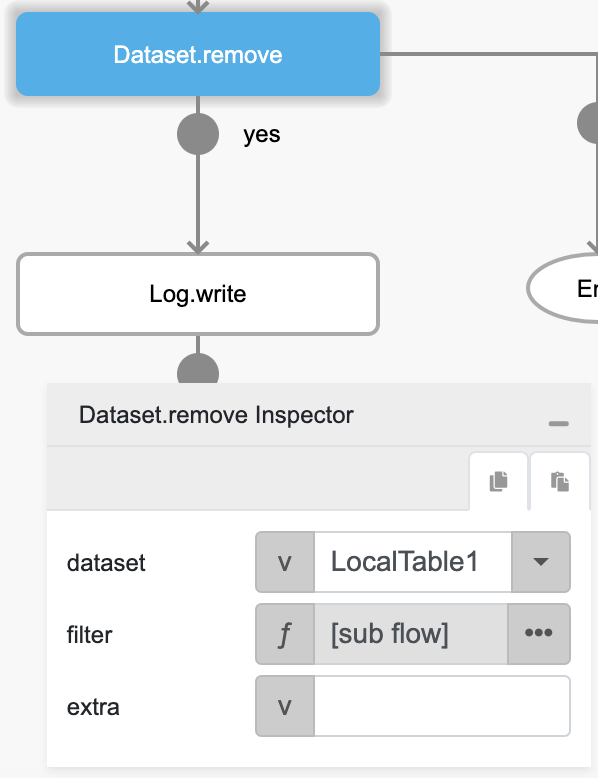
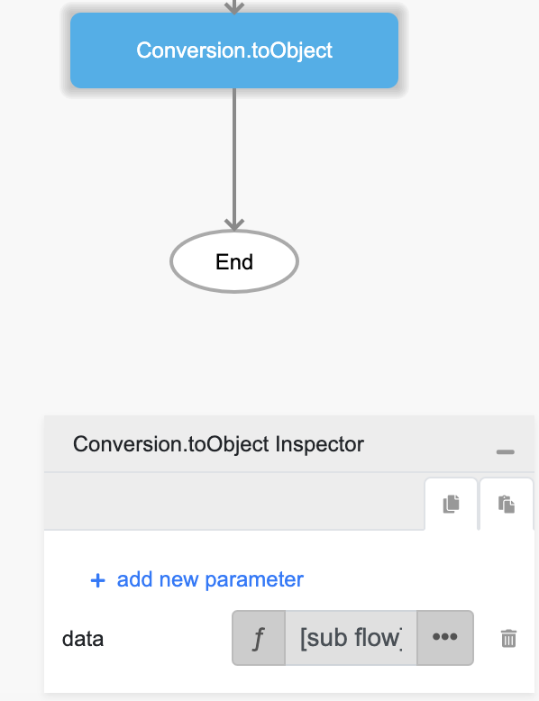
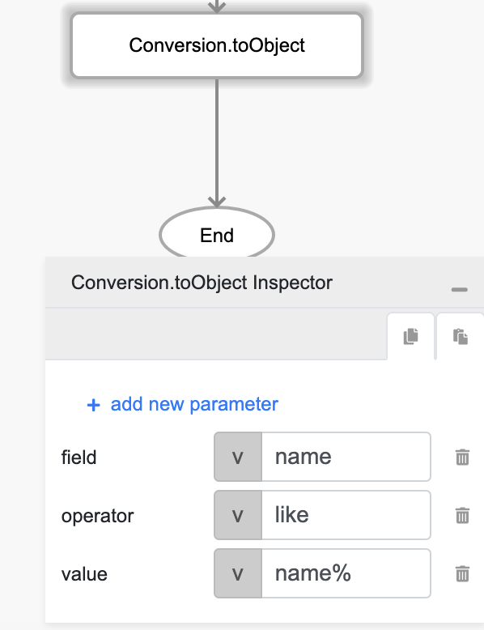

# Dataset.remove

## Description

Removes certain data from a dataset.

## Input / Parameter

| Name | Description | Input Type | Default | Options | Required |
| ------ | ------ | ------ | ------ | ------ | ------ |
| dataset | The name of the dataset that is created in Services. | Text | - | - | Yes |
| filter | The filters to be applied. | FilterFormat | - | - | No |
| extra | The stored value that is passed to all the callbacks. | Any | - | - | No |

### FilterFormat (Object)

The format used for filtering in the parameter `filter`.

| Key | Description | Input Type | Default | Options | Required |
| ------ | ------ | ------ | ------ | ------ | ------ |
| operator | Query operators used to filter multiple times. | Text | And | Or, And | No |
| data | Set of rules for another group of queries. | List | - | - | No |

#### data (List)

Will contain a list of one (1) or more objects with the following structure (dataset, operator, value) and contain zero (0) or more objects with the same structure (FilterFormat only). This can be another FilterFormat to create grouped queries.

| Key | Description | Input Type | Default | Options | Required |
| ------ | ------ | ------ | ------ | ------ | ------ |
| dataset | The dataset to filter. | Text | - | - | No |
| field | The field to be filtered. | Text | - | - | Yes |
| operator | Operators to be used for specific filtering. | Text | - | Equal, Not_Equal, Is_Null, Is_Not_Null, Greater_Than, Greater_Than_Or_Equal, Less_Than, Less_Than_Or_Equal, Like, Not_Like, In, Not_In, Between, Not_Between | Yes |
| value | The value to perform the query, which depends on the operator. | Any | - | - | No |

## Output

| Description | Output Type |
| ------ | ------ |
| Returns the formatted information. | Object |

### Object

| Key | Description | Output Type |
| ------ | ------ | ------ |
| success | Boolean value to denote whether the function was executed successfully. | Text |
| message | The message to print. | Text |
| data | Any additional message or data to print. | Text |

## Callback

### callback

The action performed if this function runs successfully.

| Description | Output Type |
| ------ | ------ |
| Returns a boolean value if data is deleted. | Boolean |

### errorCallback

The action performed if this function does not run successfully.

| Description | Output Type |
| ------ | ------ |
| Returns an error message. | Text |

## Example

The user wants to remove an item from `Local Table` data from their local storage, (this example will only works after the user has created the data using `Dataset.insert` function).

<!-- Share a scenario, like a user requirements. -->

### Steps

| No. | Description |  |
| ------ | ------ | ------ |
| 1. |  |  Make sure the `Local Table` component that's being used in `Dataset.insert` function example is exist and filled on the services panel in the service page. For `fields` field value add `name`and `title` as object key with Text type. |
| 2. |  | Drag a button component to a page in the mobile designer. |
| 3. |  | Select the event `press` and drag the `Dataset.remove` function to the event flow and fill in the parameter, for the `filter` param change it's type to a function / subflow and put `Conversion.toObject` inside it |
| 4. |  | For the `filter` param change it's type to a function / subflow and put `Conversion.toObject` inside it then add `data` as object key, change it's type to a function / subflow and put `Conversion.toObject` inside it. |
| 5. |  | Inside `data` subflow put `Conversion.toObject` inside it then add `field`, `operator`, `value` as object key with `name`, `like`, `name%` as it's value respectively. |

<!-- Show the steps and share some screenshots.

1. .....

Format:  -->

### Result

Should be able to remove the data from local storage.