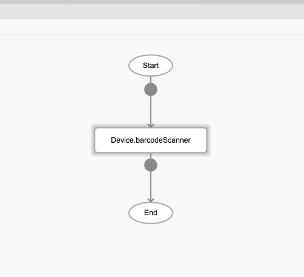

# Device.barcodeCameraScanner

## Description

Activates a barcode scanner using the camera of the device.

## Input / Parameter

| Name | Description | Input Type | Default | Options | Required |
| ------ | ------ | ------ | ------ | ------ | ------ |
| showFlipCameraButton | Show flip camera button. Supported on iOS and Android. | Boolean | true | true, false | No |
| showTorchButton | Show torch button. Supported on iOS and Android. | Boolean | true | true, false | No |
| torchOn | Launch with the torch switched on (if available). Supported on Android only. | Boolean | false | true, false | No |
| prompt | Prompt text. Supported on Android only. | Text | - | - | No |
| resultDuration | Display scanned text for X ms. 0 suppresses it entirely, default 1500. Supported on Android only. | Number | 500 | - | No |

## Output

N/A

## Callback

### callback

The function to be executed if the barcode scanner is activated successfully.

### errorCallback

The function to be executed if the barcode scanner is not activated successfully.

## Example

In this example, we will scan a barcode and display the value in a dialog.

### Steps

1. Drag a button to a page in the mobile designer. Select the event click and drag the barcodeScanner function to the event flow.

    

        
    

    

        
    

2. Drag the function to be executed when the barcode scanner is activated successfully and when it failed. In this example, we are using the Log.write function. Fill in the parameters of the function.

    

        
    

### Result

When the button is pressed, the barcode scanner will be activated. After scanning the barcode, the value will be displayed in the console.
