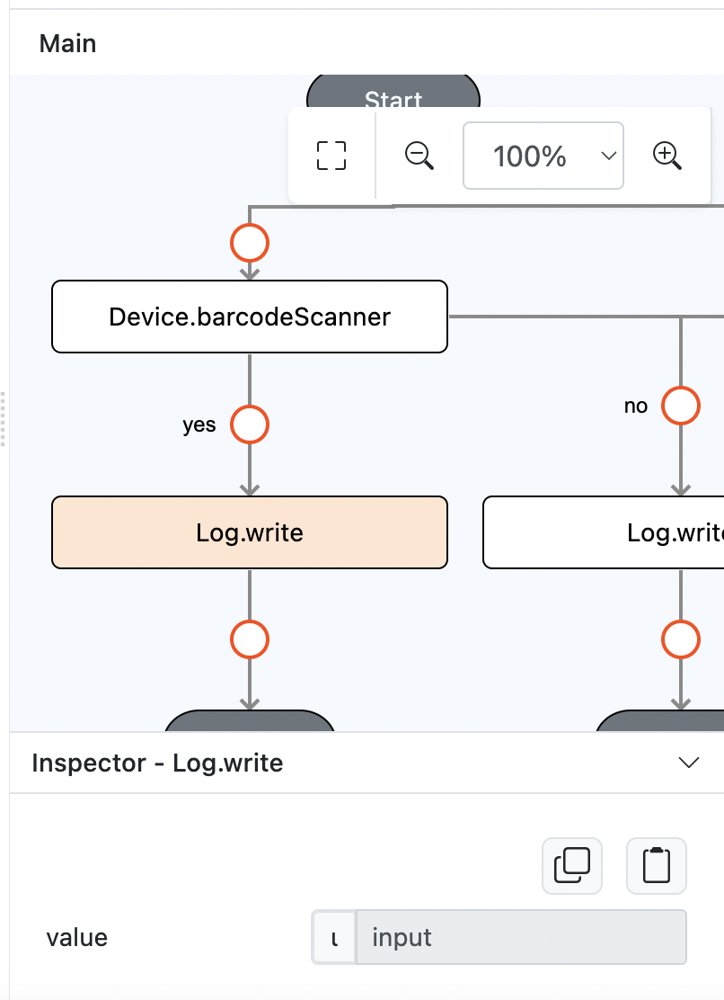

# Device.barcodeScanner

## Description

Call the barcode scanner by device type and action.

## Input / Parameter

| Name   | Description                                   | Input Type | Default | Options                                  | Required |
| ------ | --------------------------------------------- | ---------- | ------- | ---------------------------------------- | -------- |
| device | The barcode scanner device type.              | Text       | -       | zebra                                    | Yes      |
| action | The action to be done on the barcode scanner. | Text       | -       | trigger, enable, disable, event_listener | Yes      |

## Output

The function will return the formatted text.

## Callback

### callback

The function to be executed if an action triggered.

### errorCallback

The function to be executed if an action failed on trigger.

### eventListenerCallback

The function to be executed if the action is `action_listener` and this one will be called when some actions return after the scan process.

## Example

In this example, we will use `Device.barcodeScanner` to `trigger` the barcode scanner and we will use `zebra` as the device type.

### Steps

1. Drag a button to a page in the mobile designer. Select the event click and drag the `Device.barcodeScanner` function to the event flow.

    

        
    

     
    

        
    

     
2. Drag the function to be executed when trigger is success and when it failed. In this example, we are using the `Log.write` function as the callbacks.

    

        
    

### Result

N/A