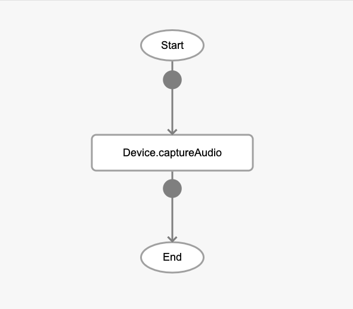
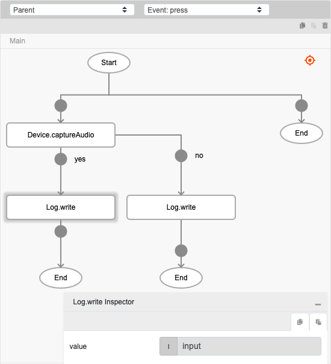

# Device.captureAudio

## Description

Activates the voice recording UI to capture audio.

## Input / Parameter

N/A

## Output

| Description | Output Type |
| ------ | ------ |
| Returns the formatted information. | Object |

### Object

| Key | Description | Output Type |
| ------ | ------ | ------ |
| success | Boolean value to denote whether the function was executed successfully. | Text |
| message | The message to print. | Text |
| data | Any additional message or data to print. | Text |

## Callback

### callback

The function to be executed when the voice recording is generated successfully.

### errorCallback

The function to be executed when the voice recording is not generated successfully.

## Example

In this example, we will create a voice recording using a mobile device and print the audio file path in the console.

### Steps

1. Drag a button component to a page in the mobile designer. Select the event `press` and drag the `Device.captureAudio` function to the event flow.

    

        
    

2. Drag the function to be executed if the audio recording is successful or failed to the node below the function. In this example, we are using the `Log.write` function. Fill in the parameters of the function.

    

        
    

### Result

1. The path of the audio file will be shown in the console.
