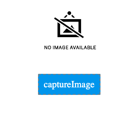
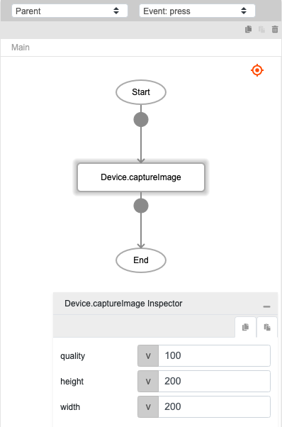
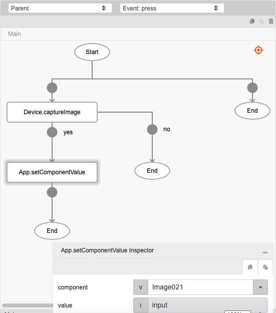

# Device.captureImage

## Description

Activates the camera of the mobile device to capture image.

## Input / Parameter

| Name | Description | Input Type | Default | Options | Required |
| ------ | ------ | ------ | ------ | ------ | ------ |
| quality | The quality of the saved image. (Ranging from 0-100, where 100 is the full resolution.) | Number | - | - | Yes |
| height | The height to scale the image to, in pixels. | Number | - | - | Partial (Yes if 'width is provided'.) |
| width | The width to scale the image to, in pixels. | Number | - | - | Partial (Yes if 'height' is provided'.) |

## Output

| Description | Output Type |
| ------ | ------ |
| Returns the formatted information. | Object |

### Object

| Key | Description | Output Type |
| ------ | ------ | ------ |
| success | Boolean value to denote whether the function was executed successfully. | Text |
| message | The message to print. | Text |
| data | Any additional message or data to print. | Text |

## Callback

### callback

The function to be executed if the camera captures an image successfully.

### errorCallback

The function to be executed if the camera does not capture an image successfully.

## Example

In this example, we will take a photo using a mobile device and view the photo in the image component.

### Steps

1. Drag an `image` and a `button` component to a page in the mobile designer.

    

        
    

2. Select the event `press` for the button and drag the function `Device.captureImage` to the event flow. Fill in the parameters of the function.

    

        
    

3. Drag the the function to be executed if the image is captured successfully to the node below the function. In this example, we are using the `App.setComponentValue` to set the image to the image component. Fill in the parameters of the function.

    

        
    

### Result

1. The image captured will be shown in the image component.