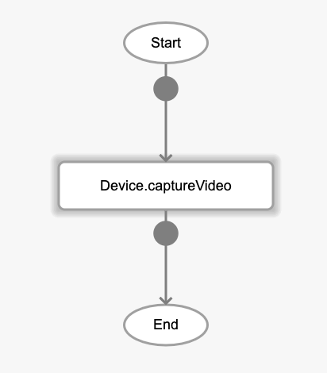
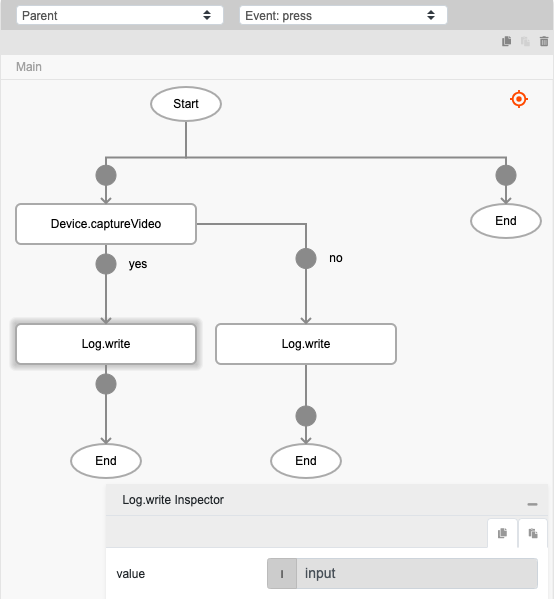

# Device.captureVideo

## Description

Activates the video recording of the mobile device to capture video.

## Input / Parameter

N/A

## Output

| Description | Output Type |
| ------ | ------ |
| Returns the formatted information. | Object |

### Object

| Key | Description | Output Type |
| ------ | ------ | ------ |
| success | Boolean value to denote whether the function was executed successfully. | Text |
| message | The message to print. | Text |
| data | Any additional message or data to print. | Text |

## Callback

### callback

The function to be executed when the video recording is generated successfully.

### errorCallback

The function to be executed when the video recording is not generated successfully.

## Example

The user wants to create a video recording using their mobile device.

### Steps

1. Drag a button component to a page in the mobile designer. Select the event `press` and drag the function `Device.captureVideo` to the event flow.

    

        
    

2. Drag the function to be executed if the video recording is successfully generated to the node below the function. In this example, we are using the `Log.write` function. Fill in the parameters of the function.

    

        
    

### Result

1. The path of the video file will be shown in the console.
