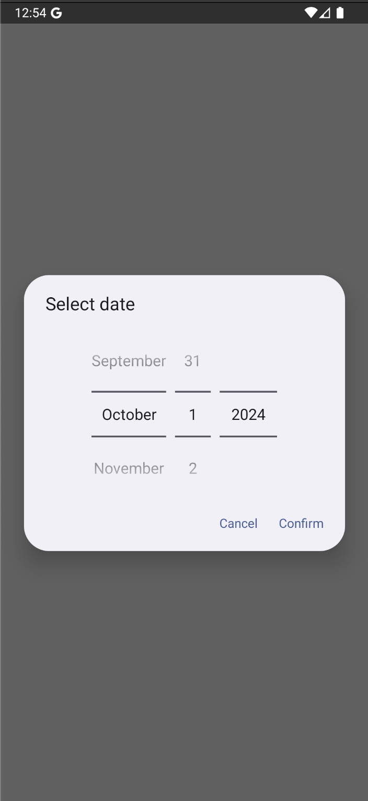
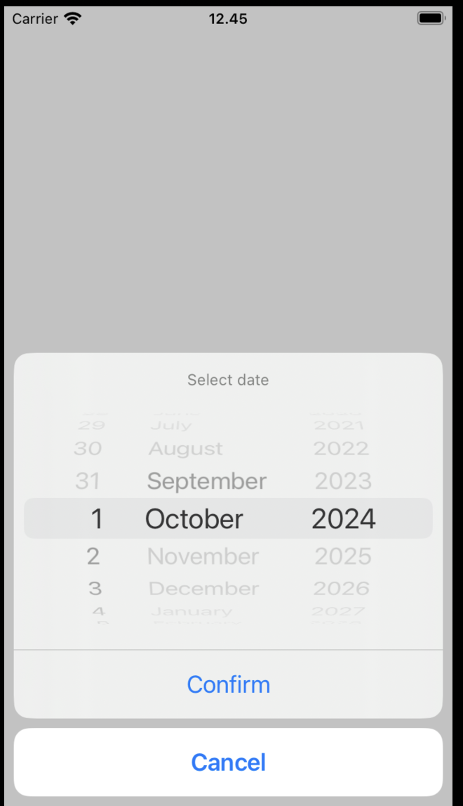

# Device.chooseDateTime

## Description

Customize a datetime picker with different formats.

## Input / Parameter

| Name         | Description             | Input Type | Default | Options | Required |
| ------------ | ----------------------- | ---------- | ------  | ------  | -------- |
| mode         | The mode of the picker. | Text       | -       | -       | No       |
| selectedDate | The selected date.      | Text       | -       | -       | No       |
| minimumDate  | The minimum date.       | Text       | -       | -       | No       |
| maximumDate  | The maximum date.       | Text       | -       | -       | No       |

## Output

| Description                        | Output Type |
| ---------------------------------- | ----------- |
| Returns the formatted information. | Text        |

## Callback

### callback

The function to be executed when the user finish picked the date.

### errorCallback

The function to be executed when the user failed to picked the date.

## Example

In this example, we will create an example button and when user click, we will show date picker based on setup parameters.

### Steps

1. Drag a button component to a page in the mobile designer. 
   
   

        
    

   
2. Select the event `press` and drag the function `Device.chooseDateTime` to the event flow and fill the parameters.

    

        
    

3. In this example, we are using the `Log.write` function as the yes callback and take input as the log.

    

        
    

### Result

1. On the app we can open the date time picker based on setup.

    Android:
    

        
    

    IOS:
    

        
    

    Platform Preview (The design will be different on native app but the functions will remain the same):
    

        
    
