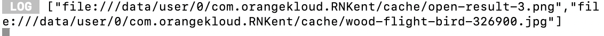

# Device.chooseFile

## Description

Selects an image or file from the device’s storage. 

## Input / Parameter

| Name | Description | Input Type | Default | Options | Required |
| ------ | ------ | ------ | ------ | ------ | ------ |
| type | Type of file to choose. | Text | - | Image, Other_Files | Yes |
| multiple | Whether to select multiple files or not. | Boolean | false | true, false | No |

## Output

| Description | Output Type |
| ------ | ------ |
| Returns the formatted information. | Object |

## Callback

### callback

The functions to be executed if file is chosen successfully. 

| Description | Output Type |
| ------ | ------ |
| The information of the chosen files. | Object |

Object format. 
```
    {
        "extra": undefined,
        "input": [
            {
            "fileCopyUri": null,
            "name": "text.txt",
            "size": 4,
            "type": "text/plain",
            "uri": "file:///data/user/0/com.firstproject/cache/text.txt"
            }
        ]
    }
```

### errorCallback

The functions to be executed if the file is not chosen. 

| Description | Output Type |
| ------ | ------ |
| The error message. | Text |

## Example

In this example, we will use the `Device.chooseFile` function to get some files data and show it on the console.

### Step

1. Call the function `Device.chooseFile` inside the eventflow, and for it's `type` param select value `Image` and for it's `multiple` param select value `true`.

    <div style="display:flex; align-items:center; justify-content:center; background-color: #E7F1FF;">
        
    </div>

2. Call the function `Log.write` inside the `Device.chooseFile` function callback, and for it's `value` param change the param type to `input`.

    <div style="display:flex; align-items:center; justify-content:center; background-color: #E7F1FF;">
        
    </div>

### Result

1. Trigger the event.

    <div style="display:flex; align-items:center; justify-content:center; background-color: #E7F1FF;">
        
    </div>

2. Select the images.

    <div style="display:flex; align-items:center; justify-content:center; background-color: #E7F1FF;">
        
    </div>

3. Check the console.

    <div style="display:flex; align-items:center; justify-content:center; background-color: #E7F1FF;">
        
    </div>