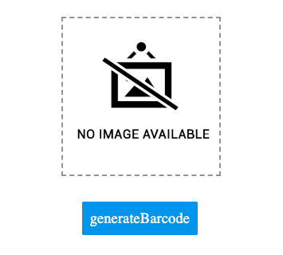
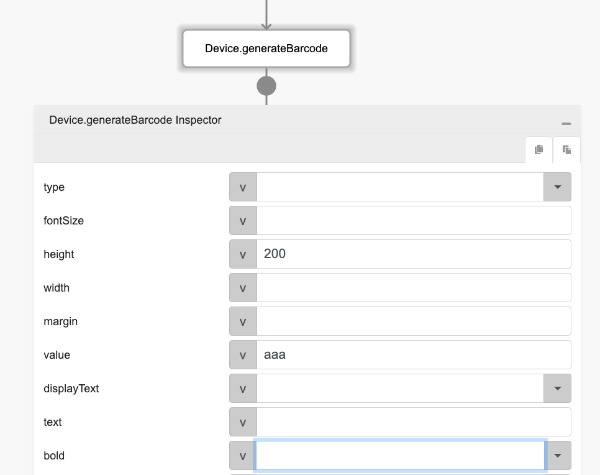
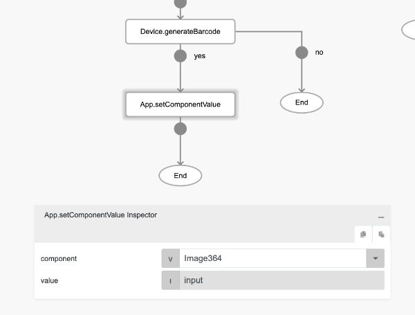
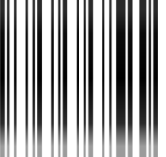

# Device.generateBarcode

## Description

Creates a machine-readable code in the form of numbers and a pattern of parallel lines of varying widths.

## Input / Parameter

| Name | Description | Input Type | Default | Options | Required |
| ------ | ------ | ------ | ------ | ------ | ------ |
| type | The type of barcode. | Text | CODE128 | - | No |
| fontSize | The font size of the barcode. | Number | 20 | - | No |
| height | The height of the barcode. | Number | 100 | - | No |
| width | The width of the barcode. | Number | 2 | - | No |
| margin | The margin of the barcode. | Number | 10 | - | No |
| value | The value of the barcode. | Text | - | - | Yes |
| displayText | To display text or not. | Boolean | true | - | No |
| text | The text to display. | Text | - | - | No |
| bold | Bolds the text. | Text | - | - | No |
| italic | Italicizes the text. | Text | - | - | No |
| textAlign | To align text or not. | Text | center | - | No |
| extra | Additional data to be used in the callbacks. | Any | - | - | No | 

## Output

| Description | Output Type |
| ------ | ------ |
| Returns the base64 barcode image pattern. | String/Text |

## Example

In this example, we will generate a barcode and display it in an image component.

### Steps

1. Drag a `button` component and an `image` component to a page in the editor to display the generated barcode.
  
    <div style="display:flex; align-items:center; justify-content:center; background-color: #E7F1FF;">
        
    </div>

2. Call the function `Device.generateBarcode` in the `press` event of the button component and set the required parameters to generate the barcode.

   ```js
   height : 200
   value : aaa
   ```
    <div style="display:flex; align-items:center; justify-content:center; background-color: #E7F1FF;">
        
    </div>

3. Call the function `App.setComponentValue` if the function `Device.generateBarcode` runs successfully and set the value to display the barcode in the image component.

    <div style="display:flex; align-items:center; justify-content:center; background-color: #E7F1FF;">
        
    </div>

4. Call the function `Log.write` if the function `Device.generateBarcode` does not run successfully and set the value to print the response in the console. Drag a `Log.write` function below the function `App.setComponentValue` as well to print the result in the console.
   
    <div style="display:flex; align-items:center; justify-content:center; background-color: #E7F1FF;">
        
    </div>

### Result

1. The image component will display the barcode generated if the function is executed successfuly and the console will print the base64 string of the image if the function is not executed successfully.

    <div style="display:flex; align-items:center; justify-content:center; background-color: #E7F1FF;">
        
    </div>
   
    <div style="display:flex; align-items:center; justify-content:center; background-color: #E7F1FF;">
        
    </div>