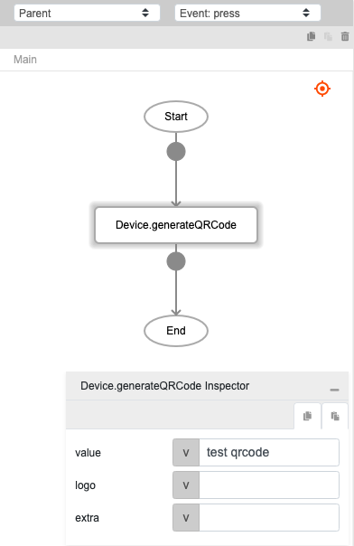
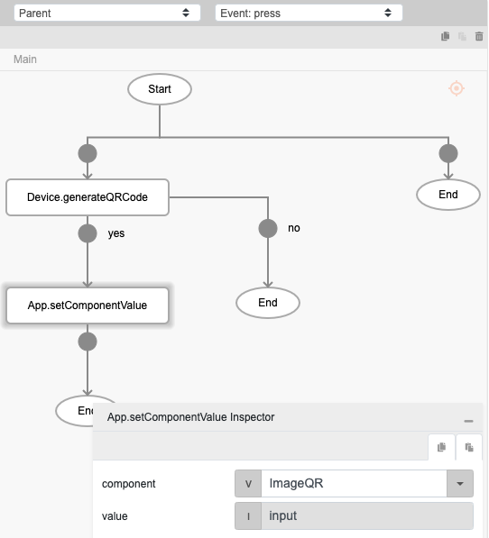
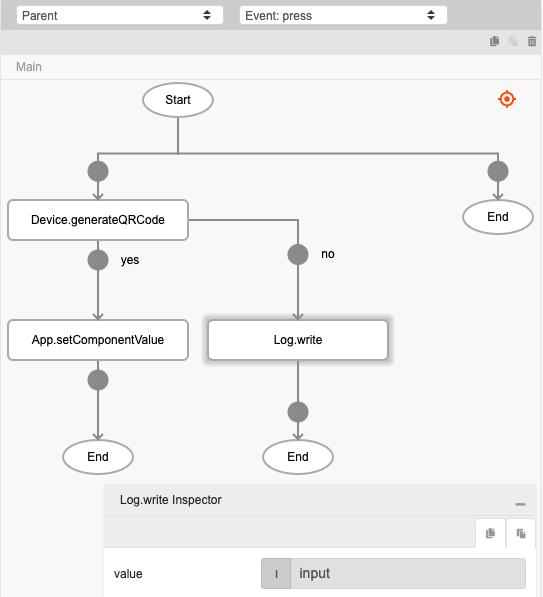
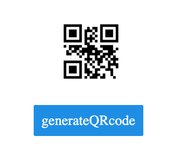

# Device.generateQRCode

## Description

Creates an image for a type of matrix barcode (QR Code).

## Input / Parameter

| Name | Description | Input Type | Default | Options | Required |
| ------ | ------ | ------ | ------ | ------ | ------ |
| type | Not currently in use by the function. | Text | - | - | No |
| value | The value to be attached to the QR code. | Text | - | - | Yes |
| logo | An image base64 or URL of an image to be appended to the QR Code. | Text | - | - | No |
| extra | The value to be included to the 'callback' as a system value under 'extra'. | Any | - | - | No |

## Output

N/A

## Callback

### callback

It is executed after the function completeled generating the matrix barcode (QR Code).

| Description | Output Type |
| ------ | ------ |
| Returns the image base64 value. | Text |

## Example

In this example, we will generate a QR code and display it in an image component.

### Steps

1. Drag a `button` component and an `image` component to a page in the editor to display the generated QR code.
  
    <div style="display:flex; align-items:center; justify-content:center; background-color: #E7F1FF;">
        
    </div>

2. Call the function `Device.generateQRCode` in the `press` event of the button component and set the required parameters to generate the QR code.

   ```js
   value : test qrcode
   ```
    <div style="display:flex; align-items:center; justify-content:center; background-color: #E7F1FF;">
        
    </div>

3. Call the function `App.setComponentValue` if the function `Device.generateQRCode` runs successfully and set the value to display the QR code in the image component.

    <div style="display:flex; align-items:center; justify-content:center; background-color: #E7F1FF;">
        
    </div>

4. Call the function `Log.write` if the function `Device.generateQRCode` does not run successfully and set the value to print the response in the console. 
   
    <div style="display:flex; align-items:center; justify-content:center; background-color: #E7F1FF;">
        
    </div>

### Result

1. The image component will display the QR code generated if the function is executed successfuly and the console will print the base64 string of the image if the function is not executed successfully. 

    <div style="display:flex; align-items:center; justify-content:center; background-color: #E7F1FF;">
        
    </div>