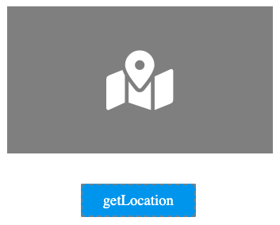

# Device.getLocation

## Description

Get the current location details (GPS coordinate) of the device.

## Input / Parameter

| Name | Description | Input Type | Default | Options | Required |
| ------ | ------ | ------ | ------ | ------ | ------ |
| timeout | Connection time out period, in millisecond. | Number | - | - | - |
| enableHighAccuracy | To enable or disable high accuracy of GPS coordinates. | Boolean | False | - | - |

## Output

| Description | Output Type |
| ------ | ------ |
| Returns the formatted information. | Object |

### Object

| Key | Description | Output Type |
| ------ | ------ | ------ |
| success | Boolean value to denote whether the function was executed successfully. | Text |
| message | The message to print. | Text |
| data | Any additional message or data to print. | Text |

## Callback

### callback

The function to be executed when location is obtained successfully.

### errorCallback

The function to be executed when location is not obtained successfully.

## Example

In this example, we will retrieve the device location data and use it as the coordinate value of the `setMapCenter` function.

### Steps

1. Drag a `map` component and a `button` component to a page in the mobile designer.

    

        
    

2. Select the event `press` for the button and drag the function `Device.getLocation` to the event flow. Fill in the parameters of the function.

    

        
    

3. Drag the function to be executed if the location data is successfully received to the node below `Device.getLocation`. In this example, we are using the `Variable.set` function to save the location data into a variable.

    

        
    

4. Drag the function `Device.setMapCenter` below `Variable.set` and fill in the parameters of the function. Use the location data from `Device.getLocation` by adding `Variable.getAttribute` to the `coordinate` field of the `Device.setMapCenter` function.

    

        
    

### Result

1. The location data will be received and it's `latLng` value (latitude and longitude) will be used as the center of the Map component.