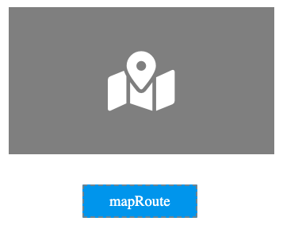
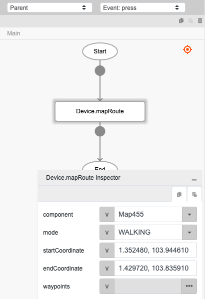

# Device.mapRoute

## Description

Display the route on the map from the start position to end position.

## Input / Parameter

| Name | Description | Input Type | Default | Options | Required |
| ------ | ------ | ------ | ------ | ------ | ------ |
| component | The name of the map component. | Text | - | - | Yes |
| mode | The route mode to show. | Text | - | DRIVING, WALKING, BICYCLING, TRANSIT | - |
| startCoordinate | The latitude and longitude of the start position. Format: latitude, longitude | Text | - | - | Yes |
| endCoordinate | The latitude and longitude of the end position. Format: latitude, longitude | Text | - | - | Yes |
| waypoints | The waypoints on the route. Format: ['latitude, longitude'] | List | - | - | - |

## Output

N/A

## Example

In this example, we will set a route using the mapRoute function and display it on the Map component.

### Steps

1. Drag a `button` component and a `map` component to a page in the mobile designer.

    

        
    

2. Select the event `press` for the button and drag the function `Device.mapRoute` to the event flow. Fill in the parameters of the function.

    

        
    

### Result

1. The map component should show the route based on the parameters passed in the `Device.mapRoute` function.