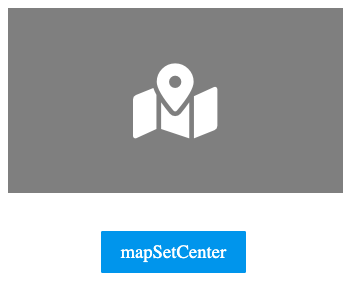
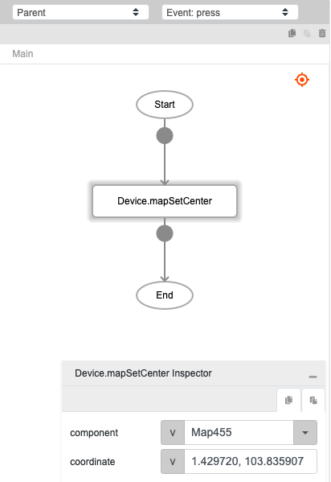

# Device.mapSetCenter

## Description

Set the center position based on the latitude and longitude provided.

## Input / Parameter

| Name | Description | Input Type | Default | Options | Required |
| ------ | ------ | ------ | ------ | ------ | ------ |
| component | The name of the map component. | Text | - | - | Yes |
| coordinate | The latitude and longitude of the point to set as center. Format: latitude,longitude | Text | - | - | - |

## Output

N/A

## Example

In this example, we will set the map component coordinate using the setMapCenter function.

### Steps

1. Make sure Map component is exist on the page and add a button component on that page.

    

        
    

2. Select the event `press` for the button and drag the function `Device.setMapCenter` to the event flow. Fill in the parameters of the function.

    

        
    

### Result

1. The center of the map component will be moved following the coordinate from `Device.setMapCenter` function