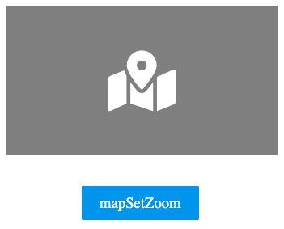
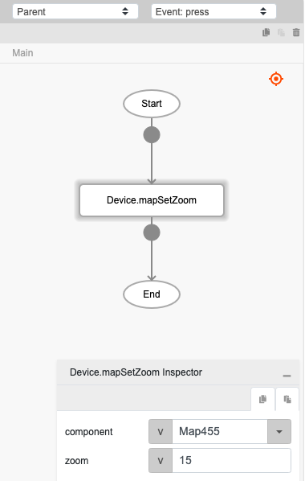

# Device.mapSetZoom

## Description

Zoom in or out of the map component.

## Input / Parameter

| Name | Description | Input Type | Default | Options | Required |
| ------ | ------ | ------ | ------ | ------ | ------ |
| component | The name of the map component. | Text | - | - | Yes |
| zoom | The value to zoom by. | Number | - | - | - |

## Output

N/A

## Example

In this example, we will set the map component zoom value using the mapSetZoom function.

### Steps

1. Drag a `button` component and a `map` component to a page in the mobile designer.

    

        
    

2. Select the event `press` for the button and drag the function `Device.mapSetZoom` to the event flow. Fill in the parameters of the function.

    

        
    

### Result

1. The zoom value of the map component will follow the zoom value passed in the `Device.mapSetZoom` function.