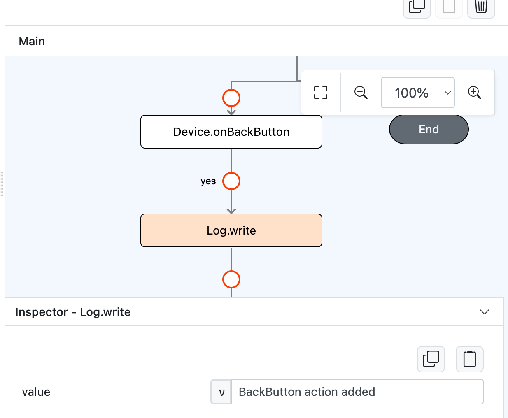
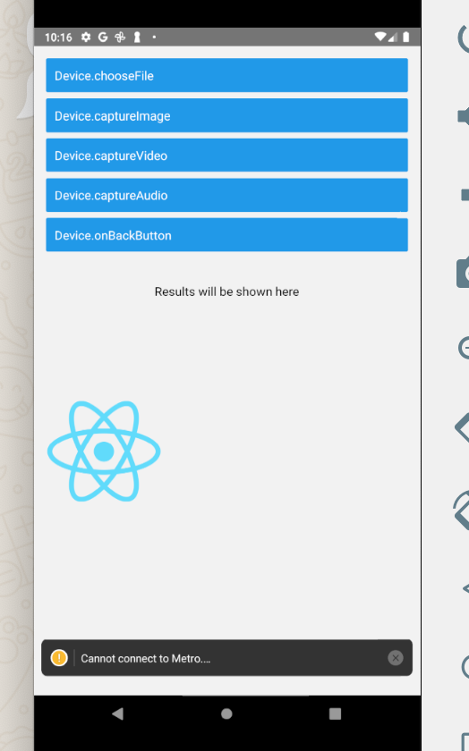

# Device.onBackButton

## Description

Triggers the back button to navigate to another page.

## Input / Parameter

N/A

## Output

| Description | Output Type |
| ------ | ------ |
| Returns the formatted information. | Object |

## Callback

### callback

The action performed if this function runs successfully.

| Description | Output Type |
| ------ | ------ |
| The functions to be executed when the back button is triggered successfully.  | Boolean |

## Example

In this example, we will use `Device.onBackButton` for going back to the previous page.

```js
Note: This example will only work after the user has created another page and navigate to that page using `Global.goToPage` function.
```

### Steps

1. Drag a button component to a page in the mobile designer, select the event `press` and drag the `Device.onBackButton` function to the event flow.

    <div style="display:flex; align-items:center; justify-content:center; background-color: #E7F1FF;">
        
    </div>

### Result

1. Open the installed app on a device and navigate to another page and then press the button that has `Device.onBackButton` in it's press event.

    <div style="display:flex; align-items:center; justify-content:center; background-color: #E7F1FF;">
        
    </div>

2. It will navigate to the previous page.

    <div style="display:flex; align-items:center; justify-content:center; background-color: #E7F1FF;">
        
    </div>