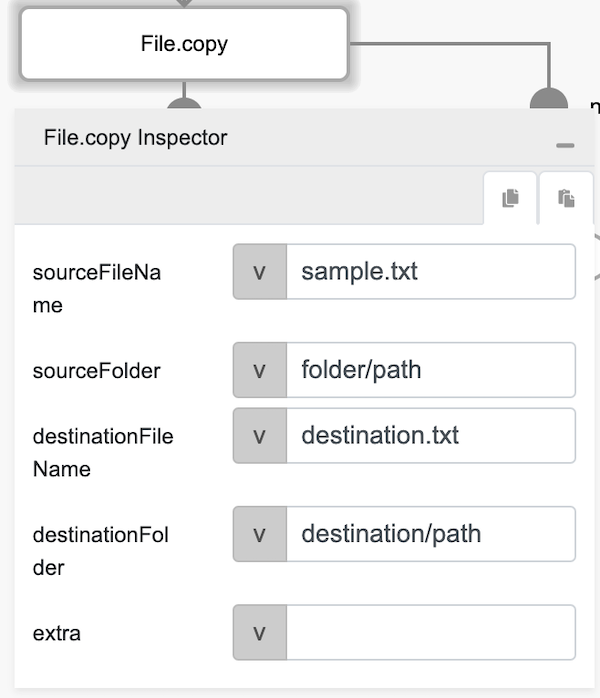
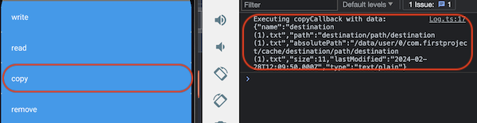

# File.copy

## Description

Copies an existing file in the cache directory of the mobile phone.

## Input / Parameter

| Name | Description | Input Type | Default | Options | Required |
| ------ | ------ | ------ | ------ | ------ | ------ |
| sourceFileName | The name of the source file to copy. | Text | - | - | Yes |
| sourceFolder | The folder path of the source file. If this input is provided, it will be appended to the storage path. | Text | - | - | No |
| destinationFileName | The name of copied file. | Text | - | - | Yes |
| destinationFolder | The folder path of the copied file. If this input is provided, it will be appended to the storage path. | Text | - | - | No |
| extra | The stored value that is passed to all the callbacks. | Any | - | - | No |

## Output

| Description | Output Type |
| ------ | ------ |
| Returns the formatted information. | Object |

### Object

| Key | Description | Output Type |
| ------ | ------ | ------ |
| success | Boolean value to denote whether the function was executed successfully. | Text |
| message | The message to print. | Text |
| data | Any additional message or data to print. | Text |

## Callback

### callback

The action performed if this function runs successfully.

| Description | Output Type |
| ------ | ------ |
| Returns an object that contains the file information. | Object |

### errorCallback

The action performed if this function does not run successfully.

| Description | Output Type |
| ------ | ------ |
| Returns an error message. | Text |

## Example

The user wants to copy a file (this example will only works after the user has created a file using `File.write` function).

<!-- Share a scenario, like a user requirements. -->

### Steps

| No. | Description |  |
| ------ | ------ | ------ |
| 1. |  | Drag a button component to a page in the mobile designer. |
| 2. |  | Select the event `press` and drag the `File.copy` function to the event flow and fill in the parameter. |
| 3. |  | Open the installed app on a device with a debugger on and try to press the Button, if the copied file exist user should be able to see the content on the console. |

<!-- Show the steps and share some screenshots.

1. .....

Format:  -->

### Result

Should be able to see the content of the newly copied file from user device.