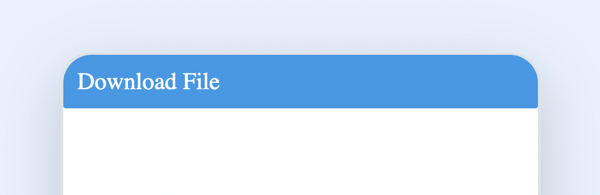
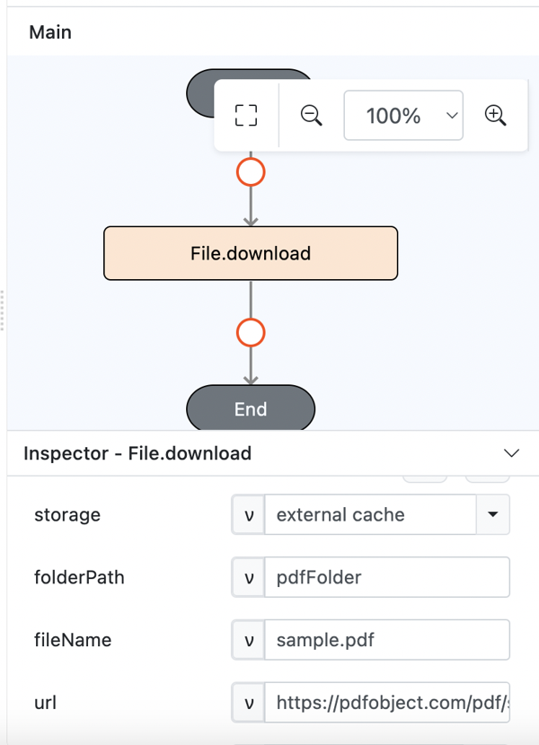
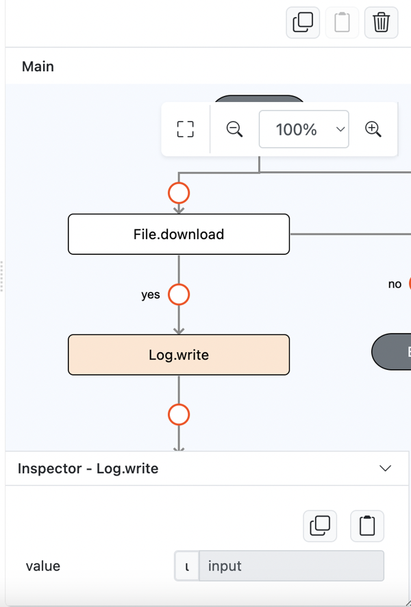
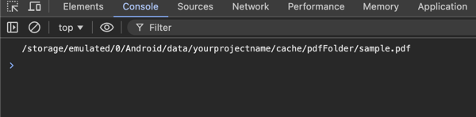
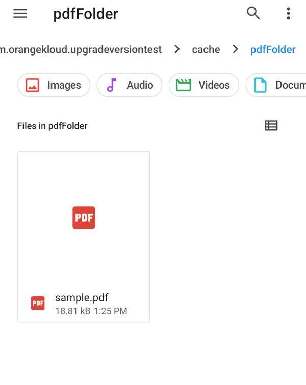

# File.download

## Description

Download a file from a url.

## Input / Parameter

| Name       | Description                                                             | Input Type | Default | Options | Required |
| ---------- | ----------------------------------------------------------------------- | ---------- | ------- | ------- | -------- |
| storage    | The native storage path to store in.                                    | Text       | -       | -       | No       |
| folderPath | The path to store the file.                                             | Text       | -       | -       | Yes      |
| fileName   | The name to store the file as.                                          | Text       | -       | -       | Yes      |
| url        | The url of the file.                                                    | Text       | -       | -       | Yes      |
| headers    | The HTTP headers required to download the file.                         | Object     | -       | -       | No       |
| extra      | The stored value that is passed to all the callbacks.                   | Any        | -       | -       | No       |

## Output

| Description                                 | Output Type |
| ------------------------------------------- | ----------- |
| Returns the formatted information.          | Text        |

## Callback

### callback

The action performed if this function runs successfully.

| Description                                     | Output Type |
| ----------------------------------------------- | ----------- |
| Returns the downloaded file path.               | Text        |

### errorCallback

The action performed if this function does not run successfully.

| Description                                 | Output Type |
| ------------------------------------------- | ----------- |
| Returns an error message.                   | Text        |

## Example

In this example, we will download a sample pdf from an url and put inside external cache folder upon click download file button.

### Steps

1. Drag a `Button` component into the service page that will trigger the `File.download` function.

    

        
    

2. Select the event `press` for the button and drag the `File.download` function to the event flow. Fill in the parameters: storage, folderPath, fileName, and url.

    

        
    

3. On the success callback, drag the `Log.write` and Fill in value as input result from `File.download` function.

    

        
    

### Result

1. Upon pressing the button, the file will be downloaded and put inside external cache folder.

    

        
    

     
    

        
    
