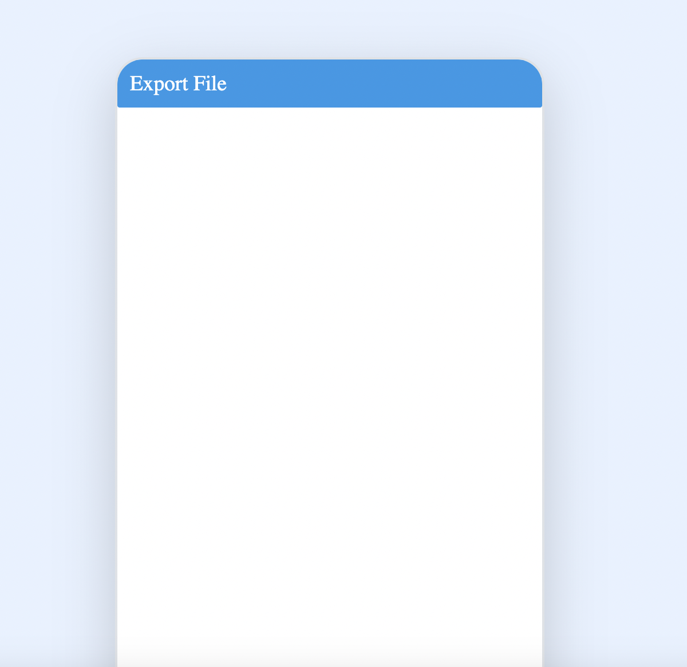
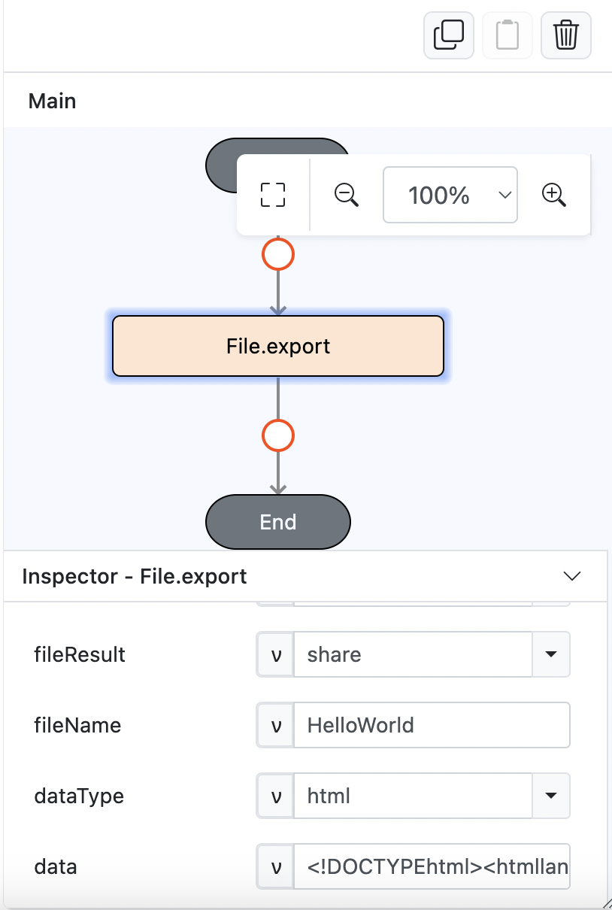
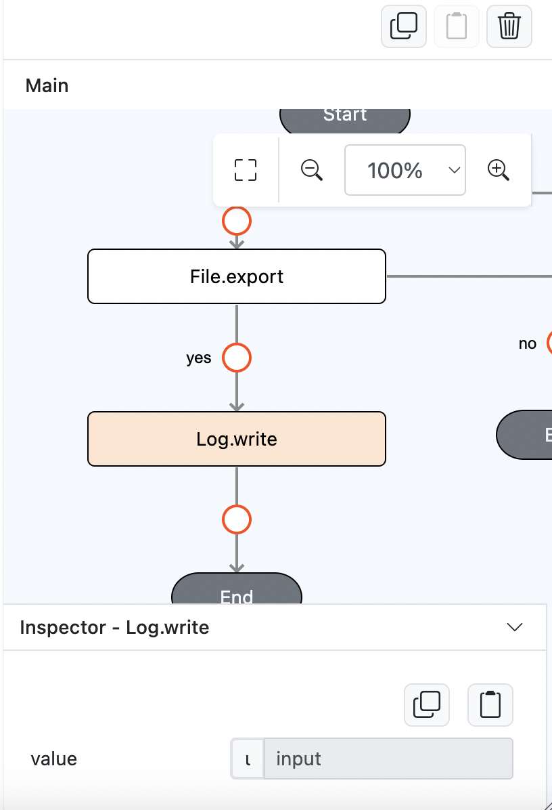
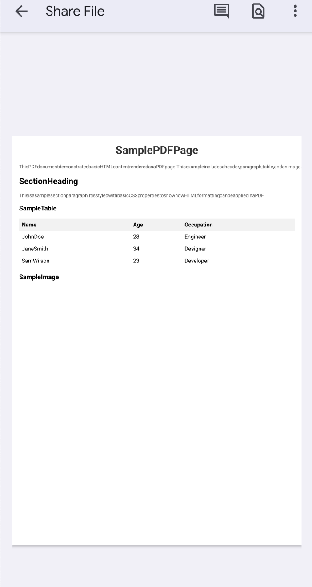

# File.export

## Description

Export data from HTML or Link into a PDF with selected format.

## Input / Parameter

| Name            | Description                                                             | Input Type | Default  | Options | Required |
| --------------- | ----------------------------------------------------------------------- | ---------- | -------  | ------- | -------- |
| fileType        | The type of file to create.                                             | Text       | PDF      | -       | Yes      |
| fileResult      | The out of this function for the created file.                          | Text       | Base64   | -       | Yes      |
| fileName        | The name of the file.                                                   | Text       | -        | -       | Yes      |
| dataType        | The content type of the file.                                           | Text       | -        | -       | Yes      |
| data            | The content data of the file base on the dataType parameter.            | Text       | -        | -       | Yes      |
| pageSize        | The size of the PDF file                                                | Text       | A4       | -       | Yes      |
| pageOrientation | The orientation of the PDF file                                         | Text       | Portrait | -       | Yes      |
| extra           | The stored value that is passed to all the callbacks.                   | Any        | -        | -       | No       |

## Output

| Description                                 | Output Type |
| ------------------------------------------- | ----------- |
| Returns the formatted information.          | Text        |

## Callback

### callback

The action performed if this function runs successfully.

| Description                                      | Output Type |
| -----------------------------------------------  | ----------- |
| Returns Base64 or a success message.             | Text        |

### errorCallback

The action performed if this function does not run successfully.

| Description                                 | Output Type |
| ------------------------------------------- | ----------- |
| Returns an error message.                   | Text        |

## Example

In this example, we will export a sample PDF from a HTML and share the PDF file upon click export file button.

### Steps

1. Drag a `Button` component into the service page that will trigger the `File.export` function.
    
    

        
    

2. Select the event `press` for the button and drag the `File.export` function to the event flow. Fill in the parameters.
    
    

        
    

3. On the success callback, drag the `Log.write` and Fill in value as input result from `File.export` function.
    
    

        
    

### Result

1. Upon pressing the button, the PDF will be shared.
   
    

        
    

     
    

        
    
