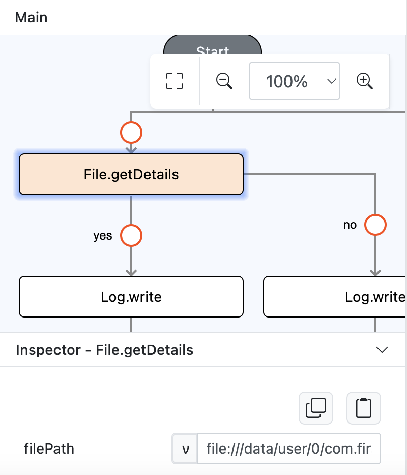

# File.getDetails

## Description

Gets the details of a file. 

## Input / Parameter

| Name | Description | Input Type | Default | Options | Required |
| ------ | ------ | ------ | ------ | ------ | ------ |
| filePath | The path the file is stored in. | Text | - | - | Yes |

## Output

| Description | Output Type |
| ------ | ------ |
| Returns file details or error message.  | Any |

### Object Return Format Example

```
{
  "name": "1000000042.jpg",
  "path": "file:///data/user/0/com.firstproject/cache/1000000042.jpg",
  "absolutePath": "file://file:///data/user/0/com.firstproject/cache/1000000042.jpg",
  "size": 46806,
  "type": "file",
  "lastModified": 0,
  "mimeType": "image/jpeg",
  "aperture": null,
  "datetime": null,
  "exposureTime": null,
  "flash": null,
  "focalLength": null,
  "gpsAltitude": null,
  "gpsAltitudeRef": null,
  "gpsDateStamp": null,
  "gpsLatitude": null,
  "gpsLatitudeRef": null,
  "gpsLongitude": null,
  "gpsLongitudeRef": null,
  "gpsProcessingMethod": null,
  "iso": null,
  "make": null,
  "model": null,
  "orientation": "0",
  "whiteBalance": null
}
```

## Callback

### callback

The functions to be executed if the details of the file are retrieved successfully. 

| Description | Output Type |
| ------ | ------ |
| Returns the details of the file. | Object |

### errorCallback

The functions to be executed if the details of the file are not retrieved. 

| Description | Output Type |
| ------ | ------ |
| Returns an error message. | Text |

## Example

In this example, we will get a file details of an image by using `File.getDetails` function.

```js
Note: This example will only work after the user has created an image file in their device.
```

### Steps

1. Drag a button component to a page in the mobile designer, select the event `press` and drag the `File.getDetails` function to the event flow and fill in the `filepath` parameter.

    <div style="display:flex; align-items:center; justify-content:center; background-color: #E7F1FF;">
        
    </div>

2. On the `File.getDetails` function callback add a `Log.write` function and change it's value param type to input.

    <div style="display:flex; align-items:center; justify-content:center; background-color: #E7F1FF;">
        
    </div>

### Result

1. Open the installed app on a device with a debugger on and try to press the button.
2. If the file exists, user should be able to see the details on the console.

    <div style="display:flex; align-items:center; justify-content:center; background-color: #E7F1FF;">
        
    </div>