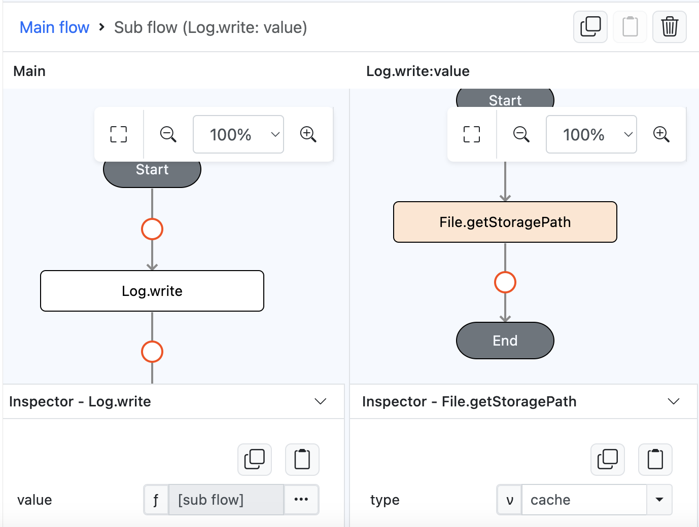

# File.getStoragePath

## Description

Retrieves the native storage path. 

## Input / Parameter

| Name | Description | Input Type | Default | Options | Required |
| ------ | ------ | ------ | ------ | ------ | ------ |
| type | The storage path of directories. | Text | cache | cache, data, external, external data, external cache | Yes |

## Output

| Description | Output Type |
| ------ | ------ |
| The storage path string.  | String |

## Callback

N/A

## Example

In this example, we will show on the console the file path of a user device cache storage.

### Steps

1. Drag a button component to a page in the mobile designer, select the event `press` and drag the `Log.write` function to the event flow and change the `value` parameter type to `input`. drag the `File.getStoragePath` function to the subflow and fill in the `type` parameter with `cache` value.

    

        
    

### Result

1. Open the installed app on a device with a debugger on and try to press the button.
2. User should be able to see the `cache` file path on the console.

    

        
    
