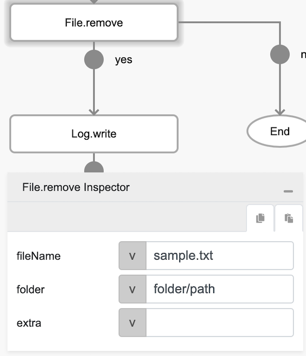
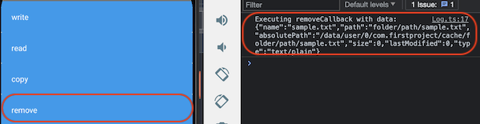

# File.remove

## Description

Removes an existing file in the cache directory of the mobile phone.

## Input / Parameter

| Name | Description | Input Type | Default | Options | Required |
| ------ | ------ | ------ | ------ | ------ | ------ |
| fileName | The name of the file to be removed. | Text | - | - | Yes |
| folder | The folder path of the file. If this input is provided, it will be appended to the storage path. | Text | - | - | No |
| extra | The stored value that is passed to all the callbacks. | Any | - | - | No |

## Output

| Description | Output Type |
| ------ | ------ |
| Returns the formatted information. | Object |

### Object

| Key | Description | Output Type |
| ------ | ------ | ------ |
| success | Boolean value to denote whether the function was executed successfully. | Text |
| message | The message to print. | Text |
| data | Any additional message or data to print. | Text |

## Callback

### callback

The action performed if this function runs successfully.

| Description | Output Type |
| ------ | ------ |
| Returns an object that contains the file information. | Object |

### errorCallback

The action performed if this function does not run successfully.

| Description | Output Type |
| ------ | ------ |
| Returns an error message. | Text |

## Example

In this example, we will remove a file from the device.

```js
Note: This example will only work after the user has created a file using `File.write` function. 
```

### Steps

1. Drag a button component to a page in the mobile designer.

    <div style="display:flex; align-items:center; justify-content:center; background-color: #E7F1FF;">
        
    </div>

2. Select the event `press` and drag the `File.remove` function to the event flow and fill in the parameter.

    <div style="display:flex; align-items:center; justify-content:center; background-color: #E7F1FF;">
        
    </div>

### Result

1. Open the installed app on a device and try to press the button.
2. The selected file should be deleted.

    <div style="display:flex; align-items:center; justify-content:center; background-color: #E7F1FF;">
        
    </div>