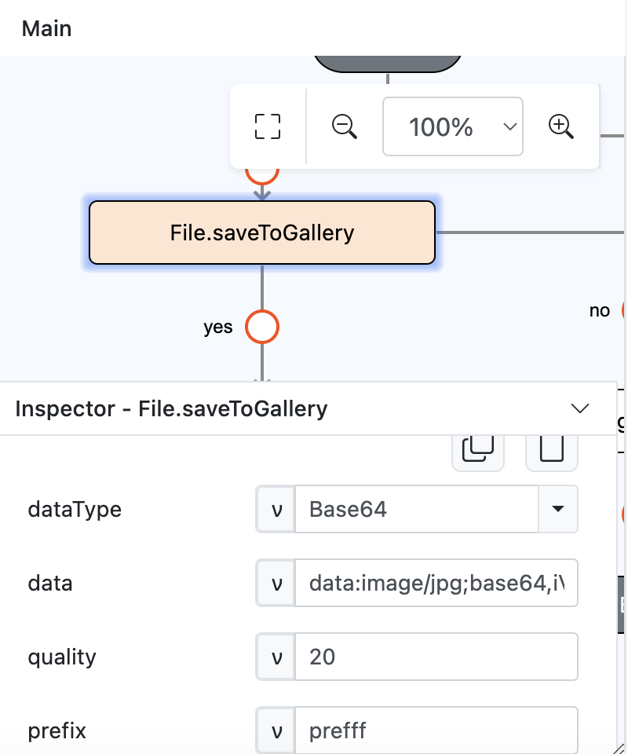
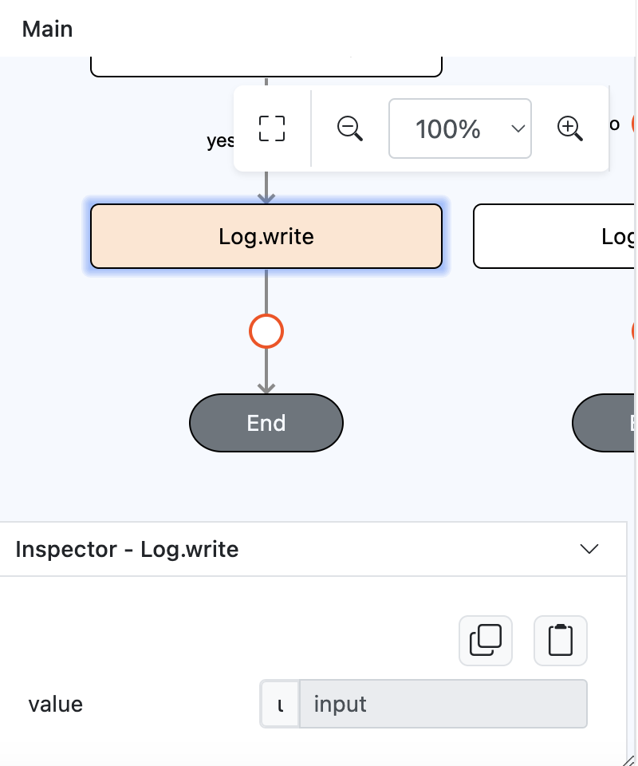
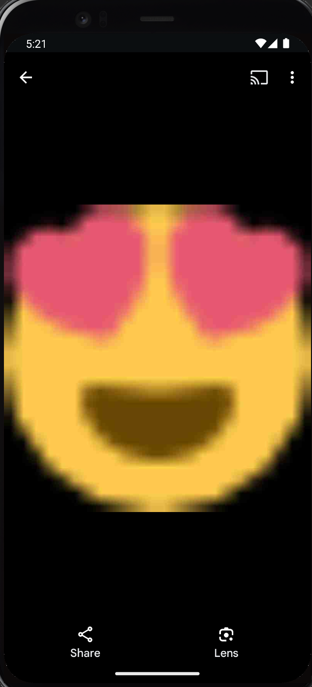

# File.saveToGallery

## Description

Saves any type of file to gallery. 

## Input / Parameter

| Name | Description | Input Type | Default | Options | Required |
| ------ | ------ | ------ | ------ | ------ | ------ |
| dataType | The type of data to save.  | Text | Base64 | Base64 | No |
| data | The data to save.   | Text | - | - | Yes |
| quality | The quality of the image file. Applicable for base64 file.   | Text | - | - | No |
| prefix | The prefix of the image file. Applicable for Android.  | Text | - | - | No |

## Output

| Description | Output Type |
| ------ | ------ |
| Returns True or error message. | Any |

## Callback

### callback

The functions to execute if the base64 image has been saved successfully. 

| Description | Output Type |
| ------ | ------ |
| Returns the new file uri. | Text |

### errorCallback

The function to execute if the base64 image is not saved successfully. 

| Description | Output Type |
| ------ | ------ |
| Returns an error message. | Text |

## Example

In this example, we will create an image file by using `File.saveToGallery` function.

### Steps

1. Drag a button component to a page in the mobile designer, select the event `press` and drag the `File.saveToGallery` function to the event flow and fill in the `dataType` parameter with `Base64` value, `data` parameter with `data:image/jpg;base64,iVBORw0KGgoAAAANSUhEUgAAABgAAAAYCAYAAADgdz34AAAABHNCSVQICAgIfAhkiAAAAAlwSFlzAAAApgAAAKYB3X3/OAAAABl0RVh0U29mdHdhcmUAd3d3Lmlua3NjYXBlLm9yZ5vuPBoAAANCSURBVEiJtZZPbBtFFMZ/M7ubXdtdb1xSFyeilBapySVU8h8OoFaooFSqiihIVIpQBKci6KEg9Q6H9kovIHoCIVQJJCKE1ENFjnAgcaSGC6rEnxBwA04Tx43t2FnvDAfjkNibxgHxnWb2e/u992bee7tCa00YFsffekFY+nUzFtjW0LrvjRXrCDIAaPLlW0nHL0SsZtVoaF98mLrx3pdhOqLtYPHChahZcYYO7KvPFxvRl5XPp1sN3adWiD1ZAqD6XYK1b/dvE5IWryTt2udLFedwc1+9kLp+vbbpoDh+6TklxBeAi9TL0taeWpdmZzQDry0AcO+jQ12RyohqqoYoo8RDwJrU+qXkjWtfi8Xxt58BdQuwQs9qC/afLwCw8tnQbqYAPsgxE1S6F3EAIXux2oQFKm0ihMsOF71dHYx+f3NND68ghCu1YIoePPQN1pGRABkJ6Bus96CutRZMydTl+TvuiRW1m3n0eDl0vRPcEysqdXn+jsQPsrHMquGeXEaY4Yk4wxWcY5V/9scqOMOVUFthatyTy8QyqwZ+kDURKoMWxNKr2EeqVKcTNOajqKoBgOE28U4tdQl5p5bwCw7BWquaZSzAPlwjlithJtp3pTImSqQRrb2Z8PHGigD4RZuNX6JYj6wj7O4TFLbCO/Mn/m8R+h6rYSUb3ekokRY6f/YukArN979jcW+V/S8g0eT/N3VN3kTqWbQ428m9/8k0P/1aIhF36PccEl6EhOcAUCrXKZXXWS3XKd2vc/TRBG9O5ELC17MmWubD2nKhUKZa26Ba2+D3P+4/MNCFwg59oWVeYhkzgN/JDR8deKBoD7Y+ljEjGZ0sosXVTvbc6RHirr2reNy1OXd6pJsQ+gqjk8VWFYmHrwBzW/n+uMPFiRwHB2I7ih8ciHFxIkd/3Omk5tCDV1t+2nNu5sxxpDFNx+huNhVT3/zMDz8usXC3ddaHBj1GHj/As08fwTS7Kt1HBTmyN29vdwAw+/wbwLVOJ3uAD1wi/dUH7Qei66PfyuRj4Ik9is+hglfbkbfR3cnZm7chlUWLdwmprtCohX4HUtlOcQjLYCu+fzGJH2QRKvP3UNz8bWk1qMxjGTOMThZ3kvgLI5AzFfo379UAAAAASUVORK5CYII=` value, `quality` parameter with `20` value and `prefix` parameter with `prefff` value.

    

        
    

2. On the `File.saveToGallery` function callback add a `Log.write` function and change it's value param type to input.

    

        
    

### Result

1. Open the installed app on a device with a debugger on and try to press the button. Check the newly created file on the gallery.

    

        
    

2. If the file exists, user should be able to see the file uri on the console.

    

        
    
