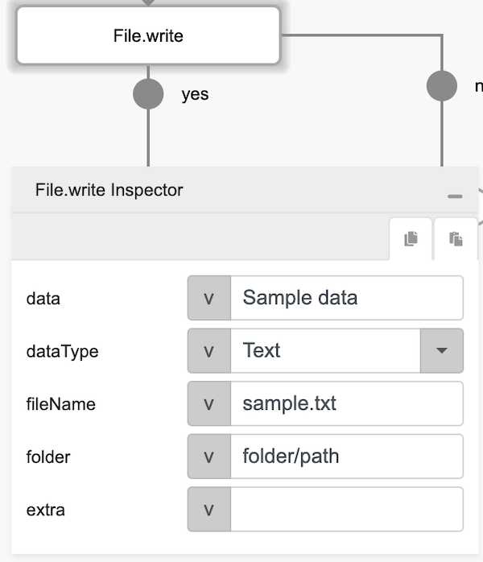
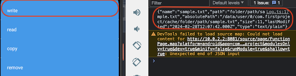

# File.write

## Description

Creates a new file or overrides an existing file in the cache directory of the mobile phone.

## Input / Parameter

| Name | Description | Input Type | Default | Options | Required |
| ------ | ------ | ------ | ------ | ------ | ------ |
| data | The file data to write. | Text | - | Base64, Text, Byte array | Yes |
| dataType | The type of file content. | Text | - | Base64, Text, Byte_Array | Yes |
| fileName | The name of the file to write. | Text | - | - | Yes |
| folder | The folder path of the file. If this input is provided, it will be appended to the storage path. | Text | - | - | No |
| extra | The stored value that is passed to all the callbacks. | Any | - | - | No |

## Output

| Description | Output Type |
| ------ | ------ |
| Returns the formatted information. | Object |

### Object

| Key | Description | Output Type |
| ------ | ------ | ------ |
| success | Boolean value to denote whether the function was executed successfully. | Text |
| message | The message to print. | Text |
| data | Any additional message or data to print. | Text |

## Callback

### callback

The action performed if this function runs successfully.

| Description | Output Type |
| ------ | ------ |
| Returns an object that contains the file information. | Object |

### errorCallback

The action performed if this function does not run successfully.

| Description | Output Type |
| ------ | ------ |
| Returns an error message. | Text |

## Example

The user wants to create a file with text value inside it.

<!-- Share a scenario, like a user requirements. -->

### Steps

| No. | Description |  |
| ------ | ------ | ------ |
| 1. |  | Drag a button component to a page in the mobile designer. |
| 2. |  | Select the event `press` and drag the `File.write` function to the event flow and fill in the parameter. |
| 3. |  | Open the installed app on a device and try to press the Button, the file will be created and ready to use. |

<!-- Show the steps and share some screenshots.

1. .....

Format:  -->

### Result

The file will be created in user device.