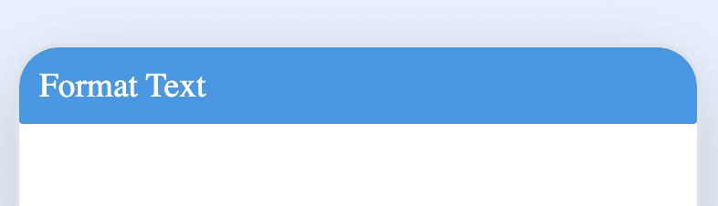
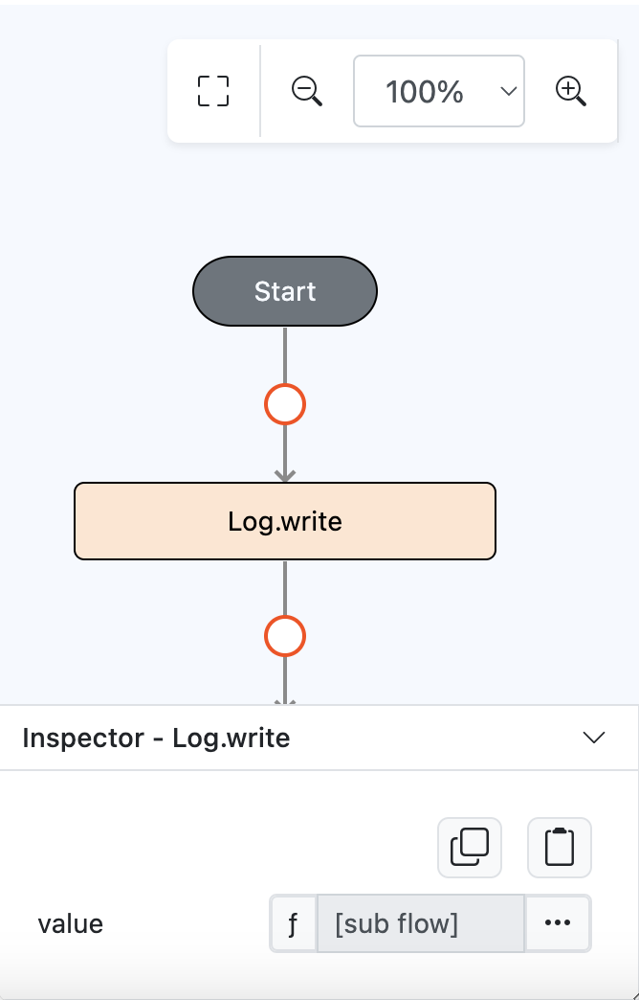
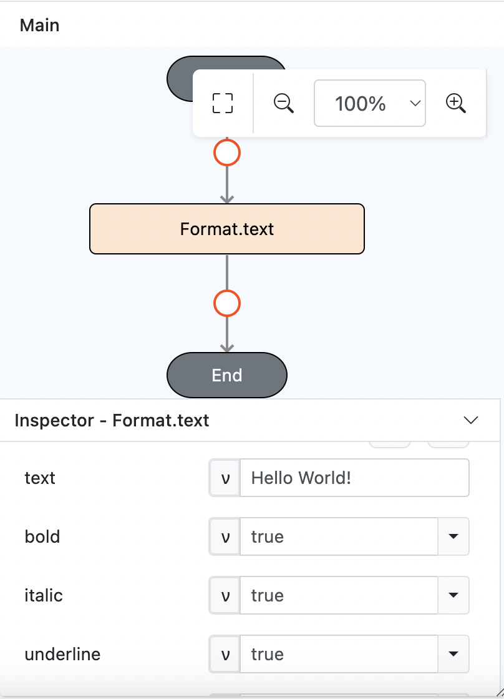
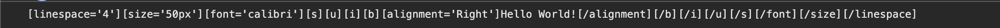

# Format.text

## Description

Generates the format for printing.

## Input / Parameter

| Name          | Description              | Input Type  | Default | Options     | Required |
| ------------- | ------------------------ | ----------- | ------- | ----------- | -------- |
| text          | The text to print.       | String/Text | -       | -           | Yes      |
| bold          | To bold or not.          | Boolean     | false   | true, false | No       |
| italic        | To italicize or not.     | Boolean     | false   | true, false | No       |
| underline     | To underline or not.     | Boolean     | false   | true, false | No       |
| strikethrough | To strikethrough or not. | Boolean     | false   | true, false | No       |
| alignment     | To align or not.         | Boolean     | false   | true, false | No       |
| font          | The name of the font.    | String/Text | -       | -           | No       |
| size          | The size of the text.    | Number      | -       | -           | No       |
| linespacing   | The space between lines. | Number      | -       | -           | No       |

## Output

| Description                                          | Output Type |
| ---------------------------------------------------- | ----------- |
| Returns the text to print with the styles specified. | String/Text |

## Example

In this example, we will format a text "Hello world!" to be showed with formatting when print using printer.

### Step

1. Drag a `button` component into the canvas and open the `Action` tab. Select the `press` event of the button.
   
    

        
    

2. Drag the `Log.write` function to the event flow and change the param type to function.
   
    

        
    

3. Put `Format.text` function inside the `value` parameter of the `Log.write` function. Fill in the parameters of the `Format.text` function.
   
    

        
    

### Result

1. Returns the formatted text to print. 

   `[linespace='5'][size='12px'][font='Calibri'][s][u][i][b][alignment='Right']Hello World[/alignment][/b][/i][/u][/s][/font][/size][/linespace]`
    

        
    
