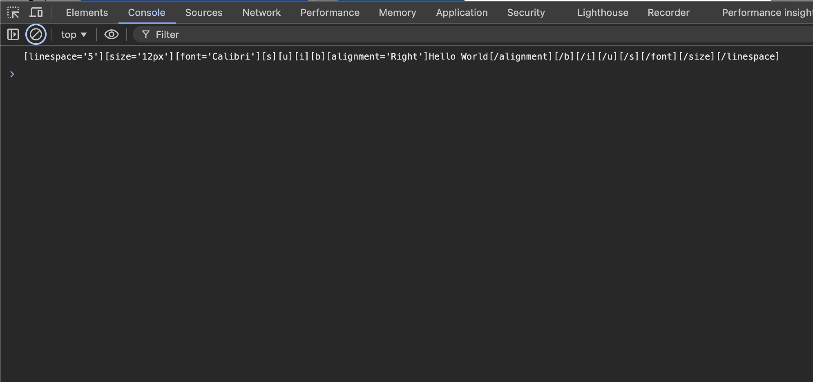

# Format.text

## Description

Generates the format for printing.

## Input / Parameter

| Name | Description | Input Type | Default | Options | Required |
| ------ | ------ | ------ | ------ | ------ | ------ |
| text | The text to print. | String/Text | - | - | Yes |
| bold | To bold or not. | Boolean | false | true, false | No |
| italic | To italicize or not. | Boolean | false | true, false | No |
| underline | To underline or not. | Boolean | false | true, false | No |
| strikethrough | To strikethrough or not. | Boolean | false | true, false | No |
| alignment | To align or not. | Boolean | false | true, false | No |
| font | The name of the font. | String/Text | - | - | No |
| size | The size of the text. | Number | - | - | No |
| linespacing | The space between lines. | Number | - | - | No |

## Output

| Description | Output Type |
| ------ | ------ |
| Returns the text to print with the styles specified. | String/Text |

### Step

1. Drag a `button` component into the canvas and open the `Action` tab. Select the `press` event of the button and drag the `Log.write` function to the event flow.
    

        
    

2. Call the function `Format.text` inside the `value` parameter of the `Log.write` function.
    

        
    

3. Fill in the parameters of the `setPrintStyle` function.
    

        
    

### Result

1. Returns the formatted text to print. 
    

        
    
