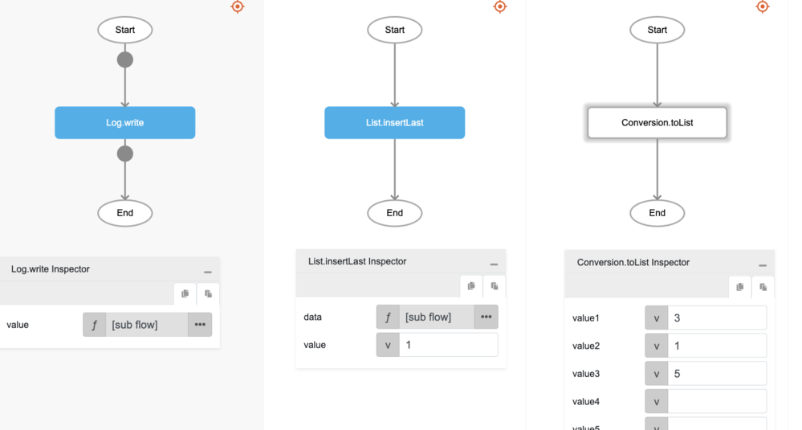
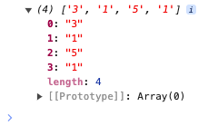

# List.insertLast

## Description

Inserts an element to the back of a list.

## Input / Parameter

| Name | Description | Input Type | Default | Options | Required |
| ------ | ------ | ------ | ------ | ------ | ------ |
| data | The list to be updated. | List | - | - | Yes |
| value | The element to be added to the list. | Any | - | - | Yes |

## Output

| Description | Output Type |
| ------ | ------ |
| Returns the updated list. | List |

## Example

In this example, we will insert a value in the last index of a list and print the result in the console.

### Step

1. Call the function `List.insertLast` inside the `Log.write` function.
2. Then call the function `Conversion.toList` inside the `List.insertLast` function.

    

        
    

### Result

1. The console will print `[3,1,5,1]`.

    

        
    

## Links 

### Related Information

See also:

- Functions
    - [Conversion.toList](/document/client/2-5-actions-and-visual-logic/action-reference/react-native/Conversion/toList/toList.md)