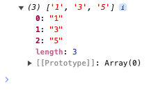

# List.sort

## Description

Sorts the elements in a list in ascending or descending order.

## Input / Parameter

| Name | Description | Input Type | Default | Options | Required |
| ------ | ------ | ------ | ------ | ------ | ------ |
| data | The list of elements to be sorted. | List | - | - | Yes |
| descending | Sorts the elements in ascending order if 'false', sorts in descending order if 'true'. | Boolean | false | true, false | No |

## Output

| Description | Output Type |
| ------ | ------ |
| Returns the sorted list. | List |

## Example

In this example, we will sort a list and print the updated list in the console.

### Step

1. Drag a `button` component to the canvas and open the `Action` tab. Select the `press` event of the button and drag the `Log.write` function to the event flow.
2. Call the function `List.sort` inside the `Log.write` function.
3. Then call the function `Conversion.toList` inside the `List.sort` function. Enter the value for `descending` parameter. (Note: When `descending` is not specified it will be false by default.)

    

        
    

### Result

1. The console will print the list in the order that is specified.
2. In this example, the value printed will be `[1, 3, 5]`, as the order of sorting is ascending.

    

        
    

## Links 

### Related Information

See also:

- Functions
    - [Conversion.toList](/document/client/2-5-actions-and-visual-logic/action-reference/react-native/Conversion/toList/toList.md)