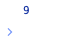

# List.sum

## Description

Sums all the numbers in a list.

## Input / Parameter

| Name | Description | Input Type | Default | Options | Required |
| ------ | ------ | ------ | ------ | ------ | ------ |
| data | The list of numbers to sum. | List | - | - | Yes |

## Output

| Description | Output Type |
| ------ | ------ |
| Returns the total value of the numbers in the list. | Number |

## Example

In this example, we will get the sum of numbers in a list and print the result in the console.

### Step

1. Call the function `List.sum` inside the `Log.write` function.
2. Then call the function `Conversion.toList` inside the `List.sum` function.
3. 3. Enter the data inside the `Conversion.toList` function. In this example, we will enter "3, 1, 5".

    

        
    

### Result

1. The console will print the sum of all the values in the list. 
2. In this example, the value printed will be `9`.

    

        
    

## Links

### Related Information 

See also:

- Functions
    - [Conversion.toList](/document/client/2-5-actions-and-visual-logic/action-reference/react-native/Conversion/toList/toList.md)