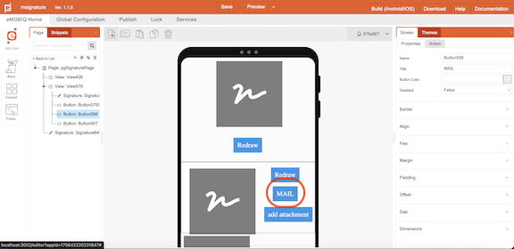
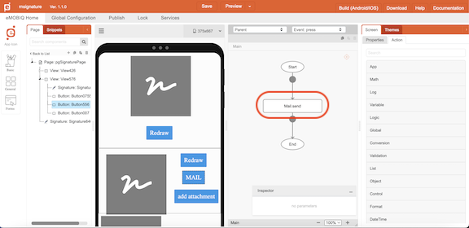
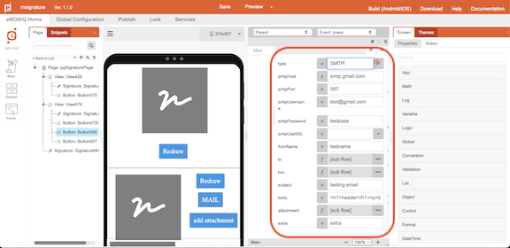

# Mail.send

## Description

Sends an e-mail through SMTP server.

## Input / Parameter

| Name | Description | Input Type | Default | Options | Required |
| ------ | ------ | ------ | ------ | ------ | ------ |
| type | Type or protocol to use. | Text | - | SMTP | required |
| smtpHost | SMTP server host URL to be used. | Text | - | - | required |
| smtpPort | SMTP port number to be used. | Number | - | - | required |
| smtpUsername | Username for the email account. | Text | - | - | required |
| smtpPassword | Password for the email account. | Text | - | - | required |
| smtpUseSSL | Enable/disable secure SSL connection. | Boolean | True | - | - |
| fromName | Sender’s display name. | Text | - | - | - |
| to | Contain a single object, or a list of one (1) or more objects which consist of: email (Text) Recipient’s email address & name (Text) – Recipient’s display name. | Object / Array | - | - | required |
| bcc | Contain a single object, or a list of one (1) or more objects which consist of: email (Text) BCC’ed email address & name (Text) – BCC’ed display name. | Object / Array | - | - | - |
| subject | The email’s title a.k.a. subject. | Text | - | - | required |
| body | The email’s content a.k.a. body. | Text | - | - | required |
| attachment | Contain a single object, or a list of one (1) or more objects which consist of: name (Text) File name that will be used.  & value (Text) – direct file path of the attachments. | Object / Array | - | - | - |
| extra | Additional data to be used in the callbacks. | Any | - | - | No | 

## Output

| Description | Output Type |
| ------ | ------ |
| Returns the formatted information. | Object |

### Object

| Key | Description | Output Type |
| ------ | ------ | ------ |
| success | Boolean value to denote whether the function was executed successfully. | Text |
| message | The message to print. | Text |
| data | Any additional message or data to print. | Text |

## Callback

### callback

The function to be executed when the email is successfully sent.

### errorCallback

The function to be executed when the email is not successfully sent.

## Example

In this example, we will send an email to a recipient.

### Steps

1. Drag a button component to a page in the mobile designer and open up the `Action` tab.

2. Select the event `press` and drag the `Mail.send` function to the event flow.

3. Fill in the parameters of the function.

### Result

1. The email recipients should receive an email from the user.