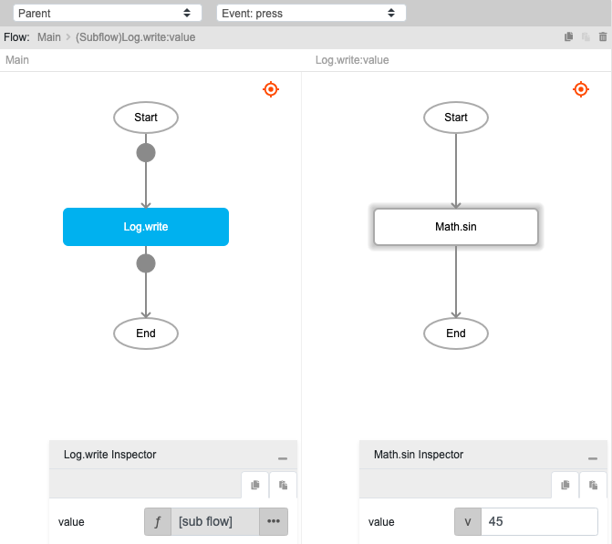
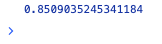

# Math.sin

## Description

Get the sine of an angle, in radians. The output will return a number between -1 and 1.

## Input / Parameter

| Name | Description | Input Type | Default | Options | Required |
| ------ | ------ | ------ | ------ | ------ | ------ |
| value | The number to return the sine of. | Number | - | - | Yes |

## Output

| Description | Output Type |
| ------ | ------ |
| Returns the sine of an angle. | Number |

## Example

In this example, we will get the sine of a value and print it in the console.

### Steps

1. Drag a `button` component into the canvas and open the `Action` tab. Select the `press` event of the button and drag the `Log.write` function to the event flow.
2. Call the function `Math.sin` inside the `Log.write` function.
3. Enter the value to get the sine of.

    

        
    

### Result

1. The console will print the sine of the value passed.

    

        
    

