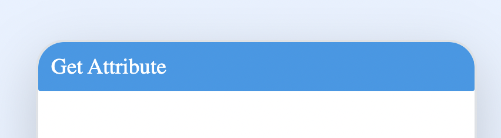
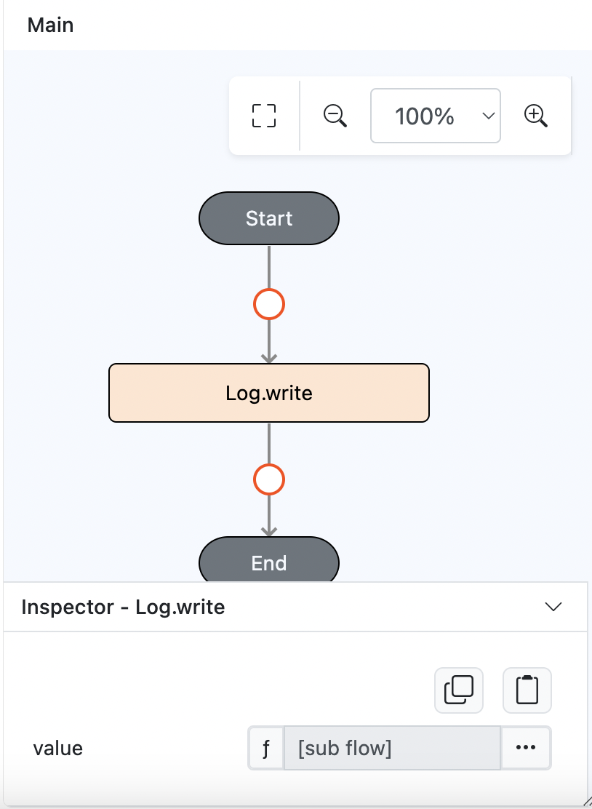
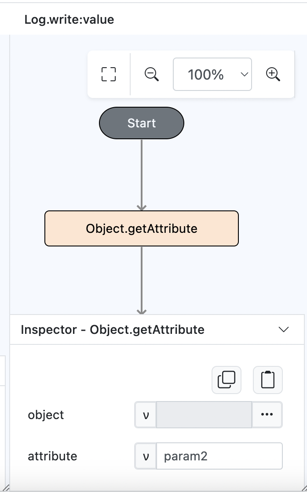
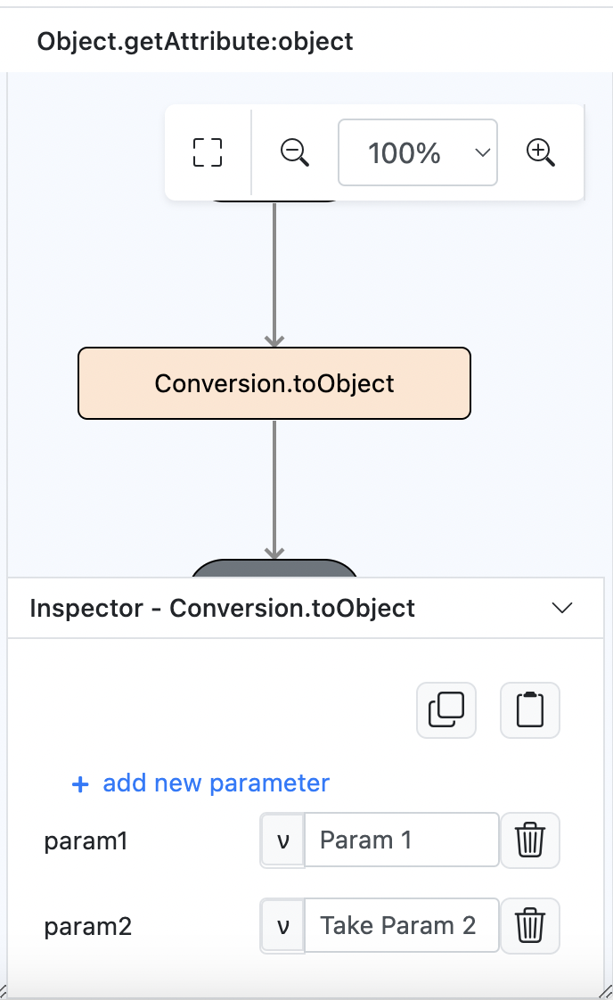
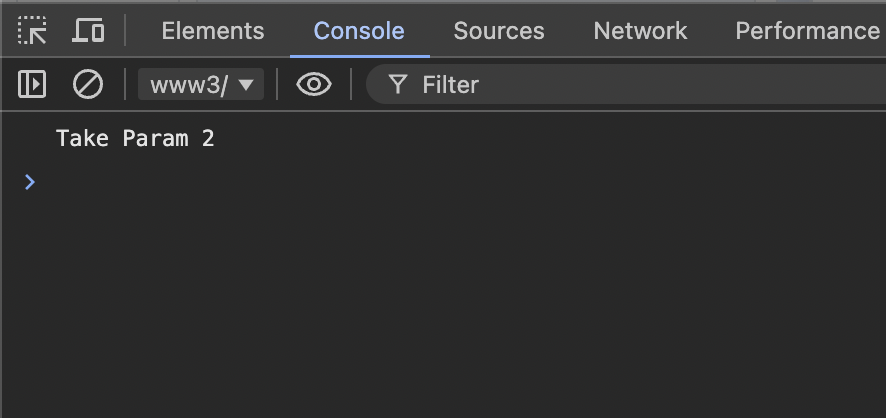

# Object.getAttribute

## Description
Returns an object attribute.

## Input / Parameter
| Name          | Description                         | Input Type  | Default | Options     | Required |
| ------------- | ----------------------------------- | ----------- | ------- | ----------- | -------- |
| object        | The object to get attribute from.   | Object      | -       | -           | Yes      |
| attribute     | The attribute to return.            | String      | -       | -           | Yes      |

## Output
| Description                                          | Output Type |
| ---------------------------------------------------- | ----------- |
| Returns the selected attribute.                      | Object      |

## Example
In this example, we will get a value using an attribute of object.

### Step
1. Drag a `button` component into the canvas and open the `Action` tab. Select the `press` event of the button.
   
    

        
    

2. Drag the `Log.write` function to the event flow and change the param type to function.
   
    

        
    

3. Put `Object.getAttribute` function inside the `value` parameter of the `Log.write` function. Fill in the parameters of the `Object.getAttribute` function.
   
    

        
    

4. For the object param, we will create a new object using `Conversion.toObject` function.
   
    

        
    

### Result
1. This function will return the value if selected param exists.
   
    

        
    
