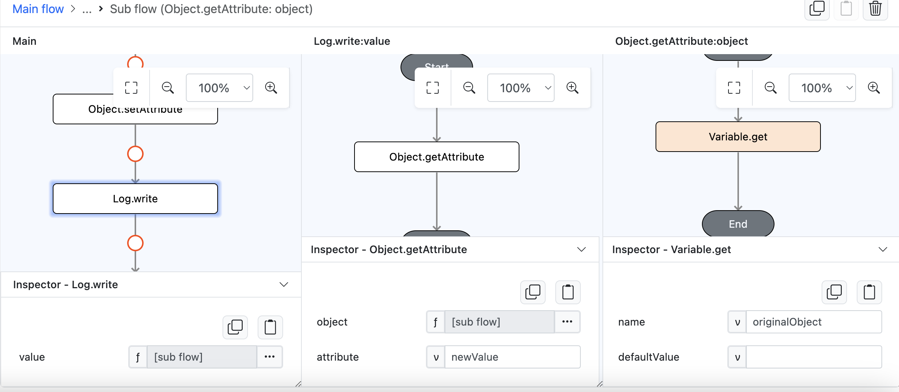

# Object.setAttribute

## Description
Sets an object’s attribute.

## Input / Parameter
| Name          | Description                         | Input Type  | Default | Options     | Required |
| ------------- | ----------------------------------- | ----------- | ------- | ----------- | -------- |
| object        | The object to set attribute for.    | Object      | -       | -           | Yes      |
| attribute     | The attribute to set.               | String      | -       | -           | Yes      |
| value         | The value to set for the attribute. | Any         | -       | -           | Yes      |

## Output
| Description                                          | Output Type |
| ---------------------------------------------------- | ----------- |
| Returns true or false.  | Boolean  |

## Example

In this example, we will add new attribute to an object and check the resulting object in the console.

### Step
1. Drag a `button` component into the canvas and open the `Action` tab. Select the `press` event of the button.
   
    

        
    

2. Drag the `Variable.set` function to the event flow and change it's `name` param value to `originalObject`, and it's `value` param type to funtion / subflow. Inside `value` subflow add `Conversion.toObject` function and add two new paremeter `value1` and `value2` with their value as `val1` and `val2`.
   
    

        
    

3. Back to the main flow add the `Object.setAttribute` function, on it's `attribute` and `value` param add `newValue` as a value for both of them and change it's `object` parameter type to a function / subflow, inside it drag a `Variable.get` function and then fill it's `name` param value with `originalObject`.
   
    

        
    

3. Back to the main flow add the `Log.write` function and change it's `value` parameter type to a function / subflow, inside it drag a `Object.getAttribute` function and then fill it's `attribute` param value with `newValue` as for it's `object` param, change the param type into a function / subflow and add the `Varable.get` function inside, on it's `name` param add `originalObject` as the value.
   
    

        
    

### Result
1. This steps will show us the updated object attribute based on it's new parameter and value on the console.

    

        
    

### Related Information

See also 

- Functions
    - [Variable.get](/document/client/006-actions-and-visual-logic/action-reference/react-native/Variable/get/get.md)
    - [Variable.set](/document/client/006-actions-and-visual-logic/action-reference/react-native/Variable/set/set.md)
    - [Object.getAttribute](/document/client/006-actions-and-visual-logic/action-reference/react-native/Object/getAttribute/getAttribute.md)
    - [Conversion.toObject](/document/client/006-actions-and-visual-logic/action-reference/react-native/Conversion/toObject/toObject.md)
    - [Log.write](/document/client/006-actions-and-visual-logic/action-reference/react-native/Log/write.md)