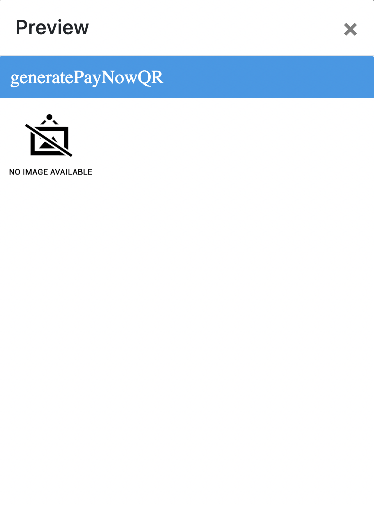
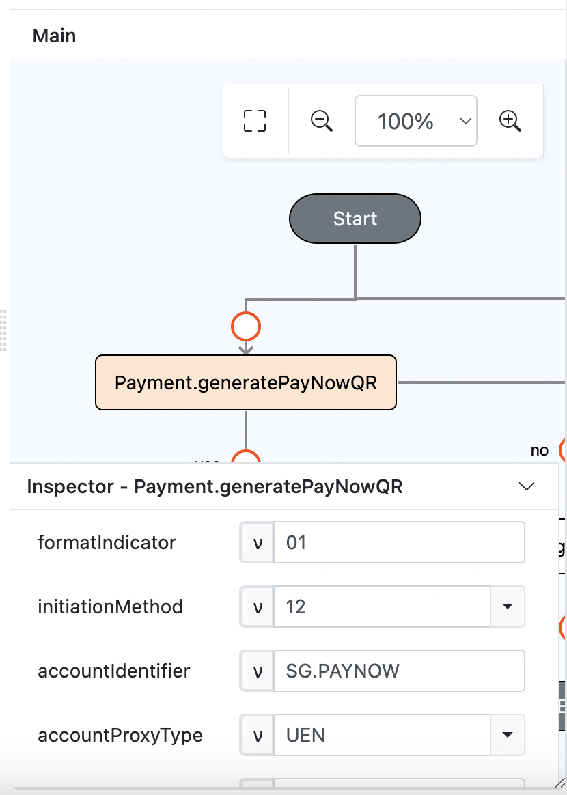
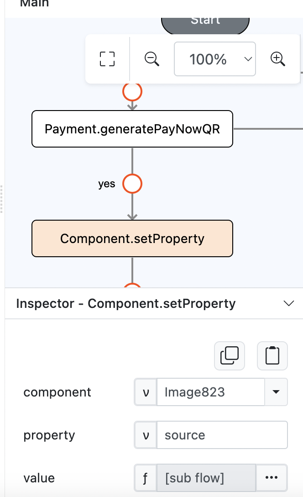
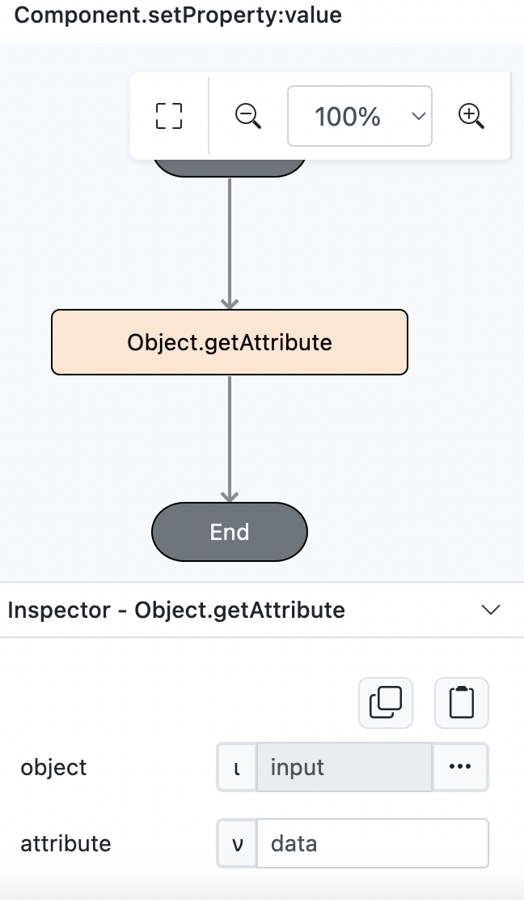
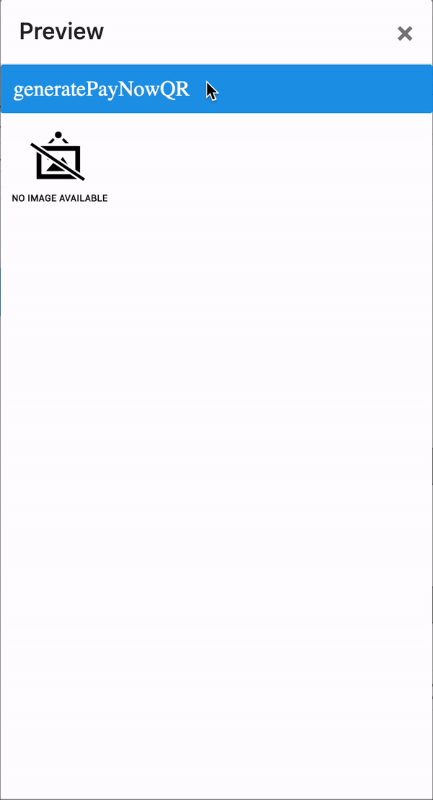

# Payment.generatePayNowQR

## Description

Generates a Paynow QR code.

## Input / Parameter

| Name                    | Description                                                    | Input Type  | Default   | Options | Required |
| ----------------------- | -------------------------------------------------------------- | ----------- | --------- | ------- | -------- |
| formatIndicator         | The format indicator for the QR code.                          | Text        | 01        | -       | No       |
| initiationMethod        | The initiation method.                                         | Text        | 11        | -       | No       |
| accountIdentifier       | The account id.                                                | Text        | -         | -       | Yes      |
| accountProxyType        | The proxy type of the account.                                 | Text        | -         | -       | Yes      |
| uen                     | The Unique Entity Number linked to the bank account to pay to. | Text        | -         | -       | Yes      |
| company                 | The company related to the bank account to pay to.             | Text        | -         | -       | Yes      |
| mobile                  | The mobile number linked to the bank account to pay to.        | Text        | -         | -       | Yes      |
| editableAmountIndicator | The editable amount indicator.                                 | Boolean     | 1         | -       | No       |
| merchantCategoryCode    | The category code of the merchant.                             | Text        | -         | -       | Yes      |
| transactionCurrency     | The currency of the transaction.                               | Text        | 702       | -       | No       |
| transactionAmount       | The transaction amount.                                        | Text        | -         | -       | No       |
| countryCode             | The country code of the merchant.                              | Text        | SG        | -       | No       |
| merchantName            | The name of the merchant.                                      | Text        | -         | -       | Yes      |
| merchantCity            | The city of the merchant.                                      | Text        | Singapore | -       | No       | 
| qrExpiryDate            | The expiry date of the QR code.                                | Text        | -         | -       | Yes      |
| billNumber              | The bill number for the transaction.                           | Text        | -         | -       | Yes      |
| logo                    | The logo of the QR code.                                       | Text        | -         | -       | No       |
| extra                   | Extra parameters stored and passed to callback.                | Any         | -         | -       | No       |

## Output

The function will return the QR Code in Base64 image data.

## Example

In this example we will use generatePayNowQR function to render QR Code into image component.

### Steps

1. Drag a `Button` and `Image` component into the editor.

    

        
    

2. Select the button and open the event flow window and find `generatePayNowQR` function and drag into event flow. Then fill all the required parameters.

    

        
    

3. Then under the function, we will drag `Component.setProperty` function to set the source of the image with input data from the output of `generatePayNowQR` function.

    

        
    

4. For the value of `Component.setProperty` function, we will change the parameter type into function and drag `Object.getAttribute` function to get the data from the input.
    

        
    

### Result

1. If we open the preview, then we click the generate button, it will shows the PayNow QR Code.

    

        
    
