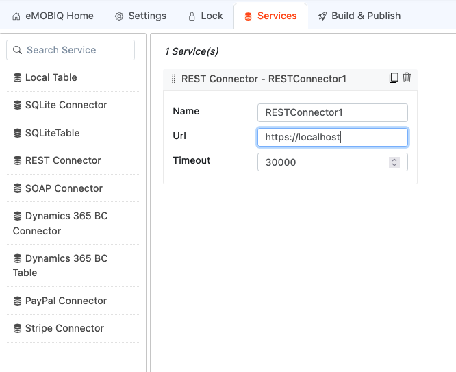
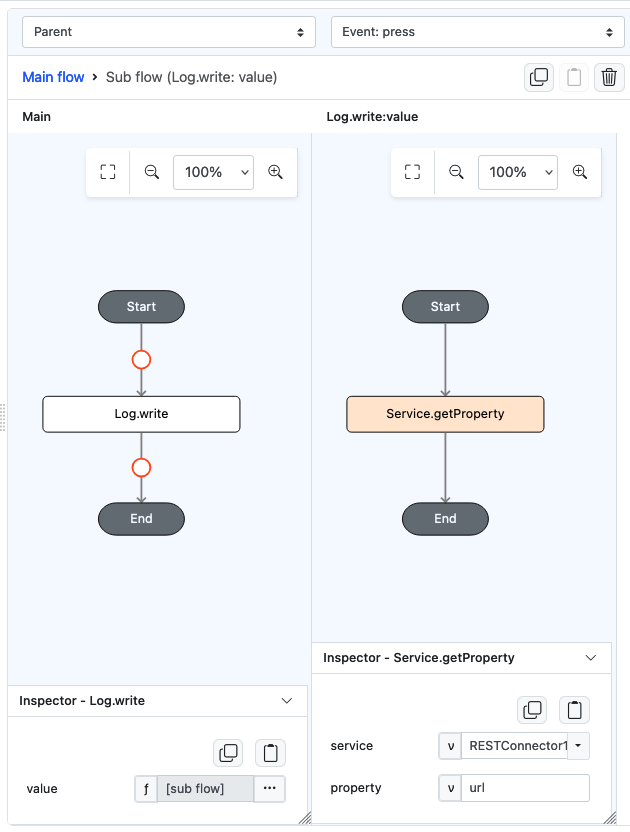
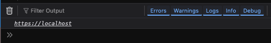

# Service.getProperty

## Description

Returns the attribute of a service

## Input / Parameter

| Name     | Description                                   | Input Type  | Default | Options | Required |
|----------|-----------------------------------------------|-------------|---------|---------|----------|
| service  | The name of the service to get property from. | String/Text | -       | -       | Yes      |
| property | The attribute of the service.                 | String/Text | -       | -       | Yes      |

## Output

| Description                          | Output Type |
|--------------------------------------|-------------|
| Returns the property of the service. | String/Text |

## Example

In this example, we will obtain the URL property of a REST connector using `Service.getProperty`. 

### Steps

1. Firstly, create a REST service by going to Service tab and drag it into the middle area

    

        
    

2. Place a Button component on a page to execute the functions
3. On the Action tab, in the click event, Create a `Log.write` function, which will call `Service.getProperty`, and specify the name of the service and property to access (which in this case will be "RESTConnector1" and URL respectively).

    

        
    

### Result

1. When opening preview, the URL attribute of "RESTConnector1" will be displayed in the browser console.

    

        
    

## Links

### Related Information

See also:

 - Functions
    - [Service.setProperty](/document/client/gitbook/2-5-actions-and-visual-logic/action-reference/react-native/Service/setProperty/)
