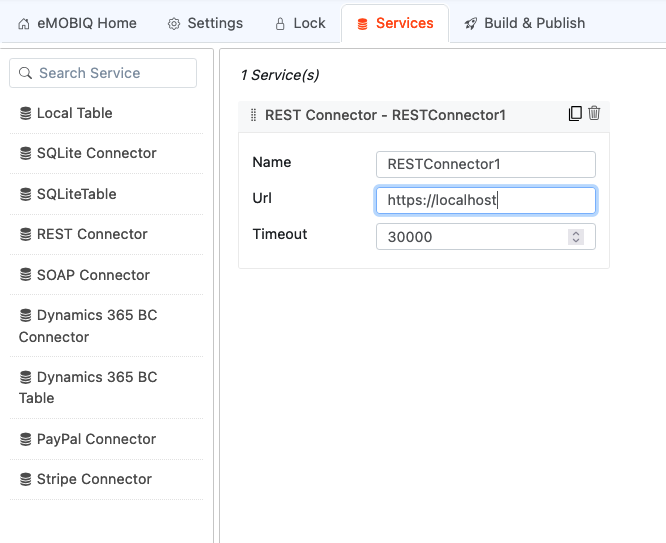
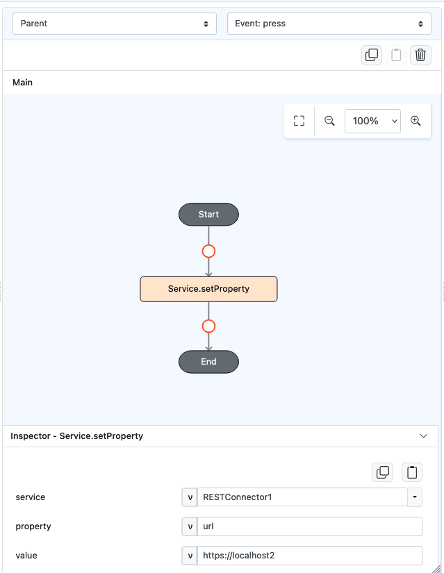
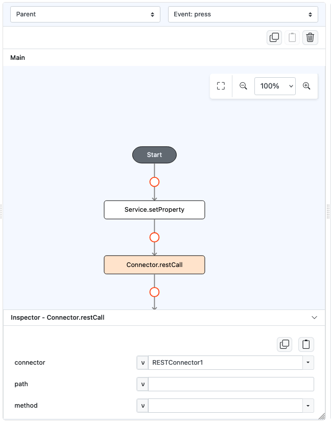

# Component.setProperty

## Description

Allows users to set a property of a service.

## Input / Parameter

| Name     | Description                                          | Input Type  | Default | Options | Required |
|----------|------------------------------------------------------|-------------|---------|---------|----------|
| service  | The name of the service.                             | String/Text | -       | -       | Yes      |
| property | The attribute to be set for the service.             | String/Text | -       | -       | Yes      |
| value    | The value of the property to be set for the service. | String/Text | -       | -       | Yes      |

## Output

N/A

## Example

In this example, we will modify the URL property of a REST connector during runtime using `Service.setProperty`.

### Steps

1. Firstly, create a REST service by going to Service tab and drag it into the middle area

    

        
    

2. Place a Button component on a page to execute the functions
3. On the Action tab, in the click event, drag the `Service.setProperty` function, and specify the name of the service and property to access (which in this case will be "RESTConnector1" and URL respectively).
   

        
    

4. Just below it, drag another function `Connector.restCall` to try using the service.
    

        
    

### Result

1. The service will call the updated URL (https://localhost2) instead of the original URL 

## Links

### Related Information

See also:

- Functions
   - [Service.getProperty](/document/client/gitbook/2-5-actions-and-visual-logic/action-reference/react-native/Service/getProperty/)
