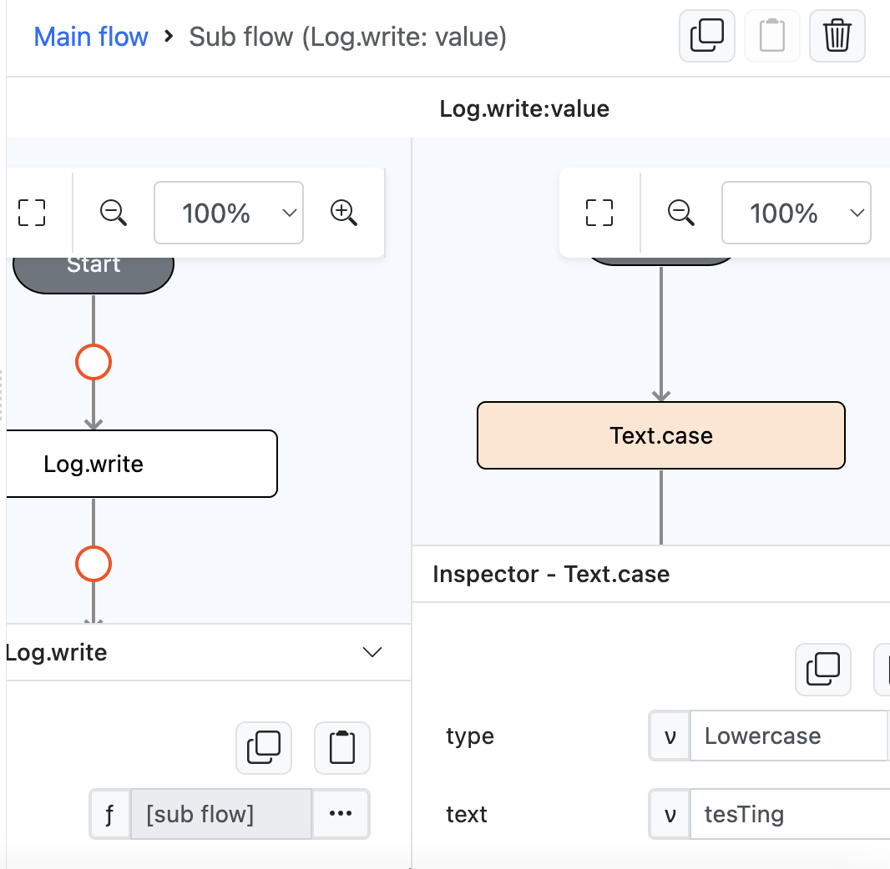
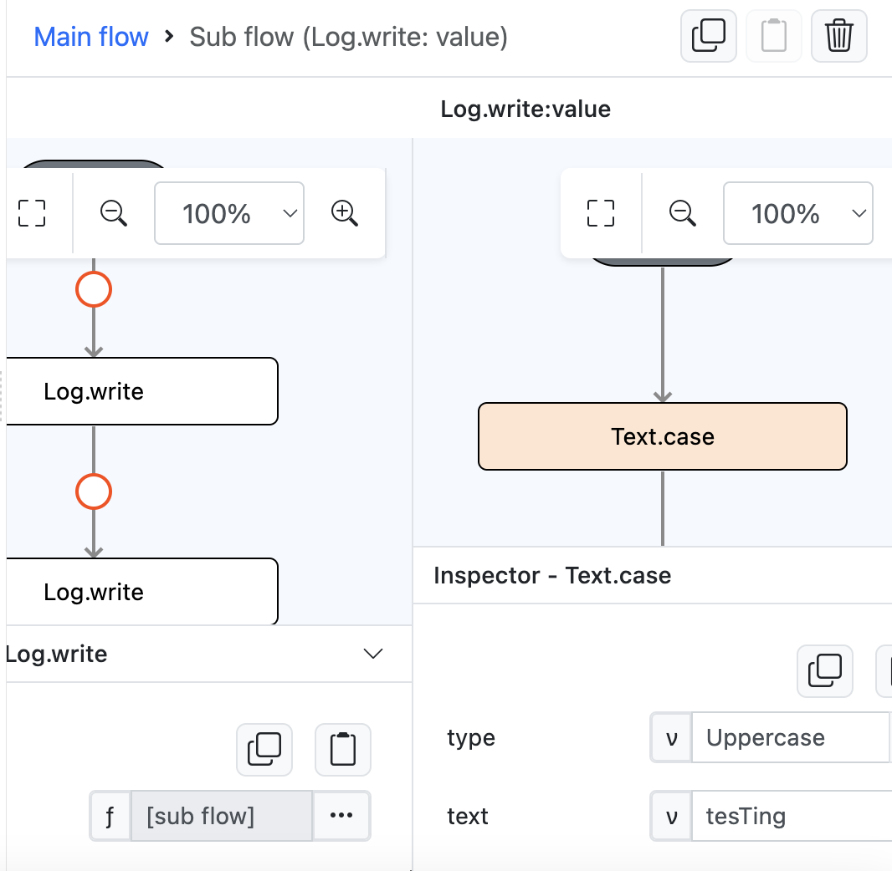
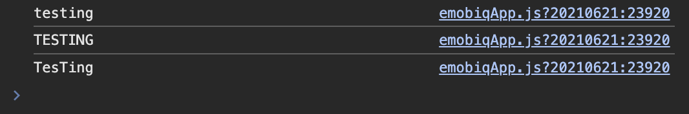

# Text.case

## Description

Convert a string of text to lowercase, uppercase or capitalize.

## Input / Parameter

| Name | Description | Input Type | Default | Options | Required |
| ------ | ------ | ------ | ------ | ------ | ------ |
| type | The type of letter casing to apply to the text. | Text | - | Lowercase , Uppercase , Capitalize | Yes |
| text | The value to be converted. | Text | - | - | Yes |

## Output

| Description | Output Type |
| ------ | ------ |
| Returns formatted text.  | String/Text |

## Example

In this example, we will format a text using case function.

### Steps

1. Drag a `button` component into the canvas and open the `Action` tab. Select the `press` event of the button.
2. Add `Log.write` function and add a subflow on it's value, then put `Text.case` inside it and fill type param with `Lowercase` and the text param with `tesTing`.

    

        
    

3. Add `Log.write` function and add a subflow on it's value, then put `Text.case` inside it and fill type param with `Uppercase` and the text param with `tesTing`.

    

        
    

4. Add `Log.write` function and add a subflow on it's value, then put `Text.case` inside it and fill type param with `Capitalize` and the text param with `tesTing`.

    

        
    

### Result

1. The console on preview will show us the formatted text value `testing`, `TESTING` & `TesTing`.

    

        
    

## Links

### Related Information