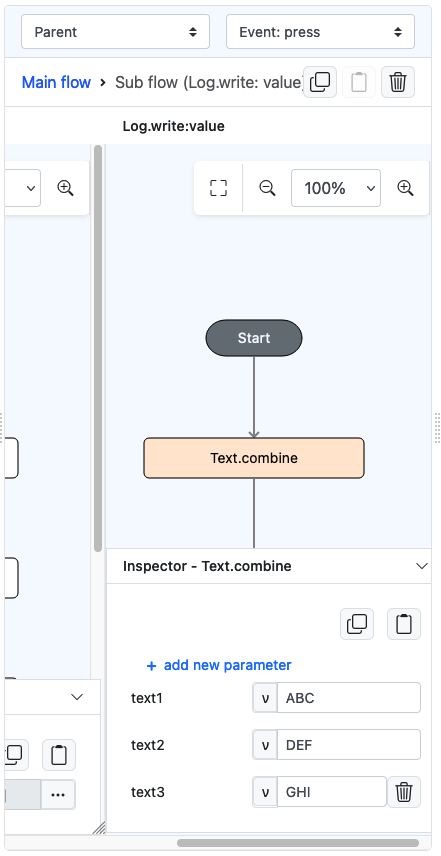
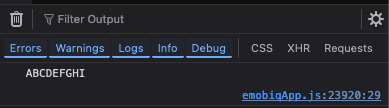

# Text.combine

## Description

Combining separate pieces of text or characters to create a larger, unified string of text.

## Input / Parameter

| Name           | Description                 | Input Type | Default | Options | Required |
|----------------|-----------------------------| ------ | ------ |---------|----------|
| text1          | The first value to combine. | Text | - | -       | No       |
| text2...text10 | Next value to combine with. | Text | - | -       | No       |

## Output

| Description                          | Output Type |
|--------------------------------------| ------ |
| Returns the combined string of text. | String/Text |

## Example

In this example, we will attempt to combine few chunks of words into a single string of text.

### Steps

1. Drag a `button` component into the canvas and open the `Action` tab. Select the `press` event of the button.
2. Add `Log.write` function and add a subflow on its value, then put `Text.combine` inside it. Subsequently, add some words in the parameter list starting from `text1` and up until needed.
    - Use **Add new parameter** button to include the next fields to fill on.
    

        
    

### Result

1. The console on preview will show the combined string in a single line of text.

    

        
    

## Links

### Related Information
