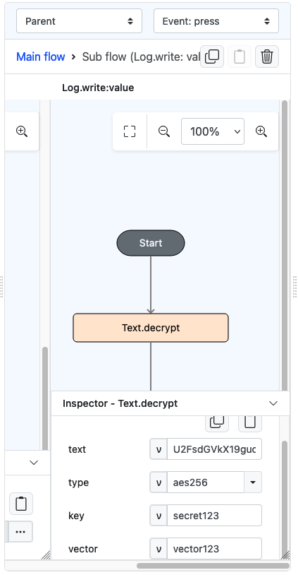
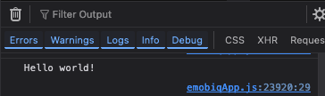

# Text.decrypt

## Description

Decrypt the value passed.

## Input / Parameter

| Name   | Description                                                 | Input Type | Default | Options     | Required              |
|--------|-------------------------------------------------------------| ------ |---------|-------------|-----------------------|
| text   | The value to be decrypted.                                  | Text | -       | -           | Yes                   |
| type   | The type of encryption to use.                              | Text | aes      | aes, aes256 | Yes                   |
| key    | The key to be used for the decryption.                      | Text | -       | -           | Yes                   |
| vector | The vector used for decryption. (Required for type ‘aes256’) | Text | -       | -           | Only for type 'aes256' |

## Output

| Description                 | Output Type |
|-----------------------------| ------ |
| Returns the decrypted text. | String/Text |

## Example

In this example, we will attempt to decrypt an already encrypted text.

### Steps

1. Drag a `button` component into the canvas and open the `Action` tab. Select the `press` event of the button.
2. Add `Log.write` function and add a subflow on its value, then put `Text.decrypt` inside it. Fill the parameter accordingly.
   - The text is taken from result of Text.encrypt() documentation.

    

        
    

### Result

1. The console on preview will show the decrypted text.

    

        
    

## Links

### Related Information
