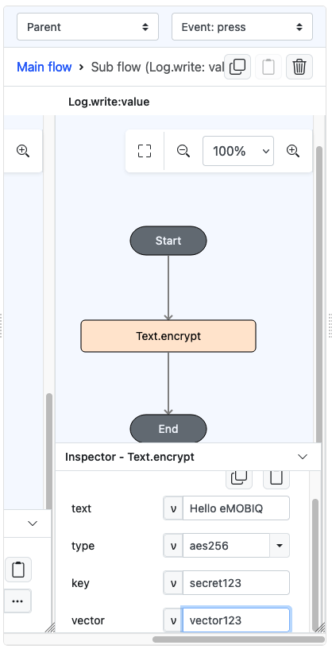
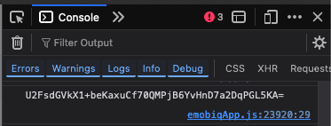

# Text.encrypt

## Description

Encrypt the value passed.

## Input / Parameter

| Name   | Description                 | Input Type | Default | Options     | Required              |
|--------|-----------------------------| ------ |---------|-------------|-----------------------|
| text   | The value to be encrypted.  | Text | -       | -           | Yes                   |
| type   | The type of encryption to use.  | Text | aes      | aes, aes256 | Yes                   |
| key    | The key to be used for the encryption.  | Text | -       | -           | Yes                   |
| vector | The vector used for encryption. (Required for type ‘aes256’)  | Text | -       | -           | Only for type 'aes256' |

## Output

| Description                          | Output Type |
|--------------------------------------| ------ |
| Returns the encrypted text.  | String/Text |

## Example

In this example, we will attempt to encrypt a text.

### Steps

1. Drag a `button` component into the canvas and open the `Action` tab. Select the `press` event of the button.
2. Add `Log.write` function and add a subflow on its value, then put `Text.encrypt` inside it. Fill the parameter accordingly.

    

        
    

### Result

1. The console on preview will show the encrypted text.
   - Note that the encrypted text can be different than displayed here, which varies from time to time. This is normal.

    

        
    

## Links

### Related Information
