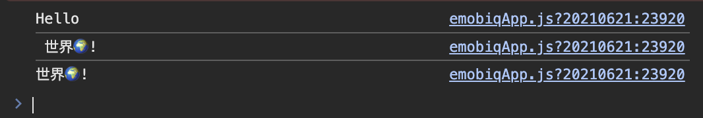

# Text.extract

## Description

Extract a specific length of characters from a string of text.

## Input / Parameter

| Name | Description | Input Type | Default | Options | Required |
| ------ | ------ | ------ | ------ | ------ | ------ |
| type | The part of the string to extract characters from. | Text | - | Left , Middle , Right | Yes |
| text | The string of text to extract from. | Text | - | - | Yes |
| length | The length of characters to extract. | Number | - | - | Yes |
| start | The index to start extracting from. | Number | - | - | Yes (Applicable for type ‘Middle’ only.) |

## Output

| Description | Output Type |
| ------ | ------ |
| Returns the extracted string of text.   | String/Text |

## Example

In this example, we will extract a part of a text using extract function.

### Steps

1. Drag a `button` component into the canvas and open the `Action` tab. Select the `press` event of the button.
2. Add `Log.write` function and add a subflow on it's value, then put `Text.extract` inside it and fill type param with `Left` and the text param with `Hello, 世界🌍!` and length param with `5`.

    

        
    

3. Add `Log.write` function and add a subflow on it's value, then put `Text.extract` inside it and fill type param with `Right` and the text param with `Hello, 世界🌍!` and length param with `6`.

    

        
    

4. Add `Log.write` function and add a subflow on it's value, then put `Text.extract` inside it and fill type param with `Middle` and the text param with `Hello, 世界🌍!` and length param with `5` and start param with `7`.

    

        
    

### Result

1. The console on preview will show us the formatted text value `Hello`, ` 世界🌍!` & `世界🌍!`.

    

        
    

## Links

### Related Information