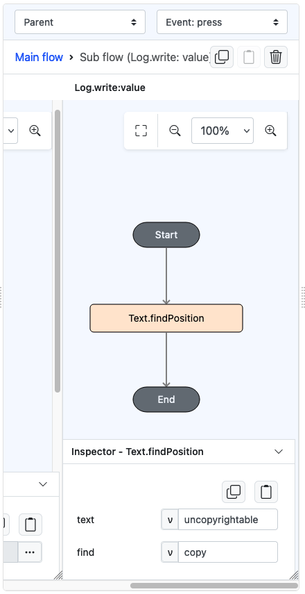
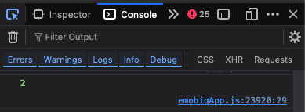

# Text.findPosition

## Description

Searches for the position of a specific element in a string of text.

## Input / Parameter

| Name | Description                 | Input Type | Default | Options | Required |
|------|-----------------------------| ------ | ------ |---------|----------|
| text | The text to be searched.  | Text | - | -       | Yes      |
| find | The element to search for in the text.  | Text | - | -       | Yes       |

## Output

| Description                          | Output Type |
|--------------------------------------|-------------|
| Returns the index/position of the character in the text, or returns -1 if the element is not found.  | Number      |

## Example

In this example, we will attempt to find the position of a word within another larger text

### Steps

1. Drag a `button` component into the canvas and open the `Action` tab. Select the `press` event of the button.
2. Add `Log.write` function and add a subflow on its value, then put `Text.findPosition` inside it. Fill up the larger text under `text`, then the word to look to look for under `find`.

    

        
    

### Result

1. The console on preview will print the number `2`, indicating that the occurrence of the word starts from the third (3rd) place of the text.
    - Note that index is zero-based. If the word exists on the very beginning of the text, The result will be `0`. Any other placement will be shifted by one.
    - If no word is found, `-1` will be returned.
   
    

        
    

## Links

### Related Information
