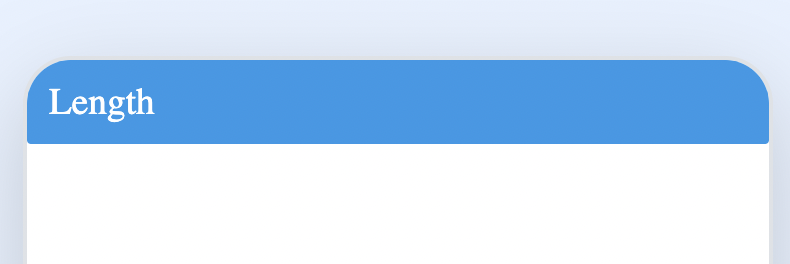
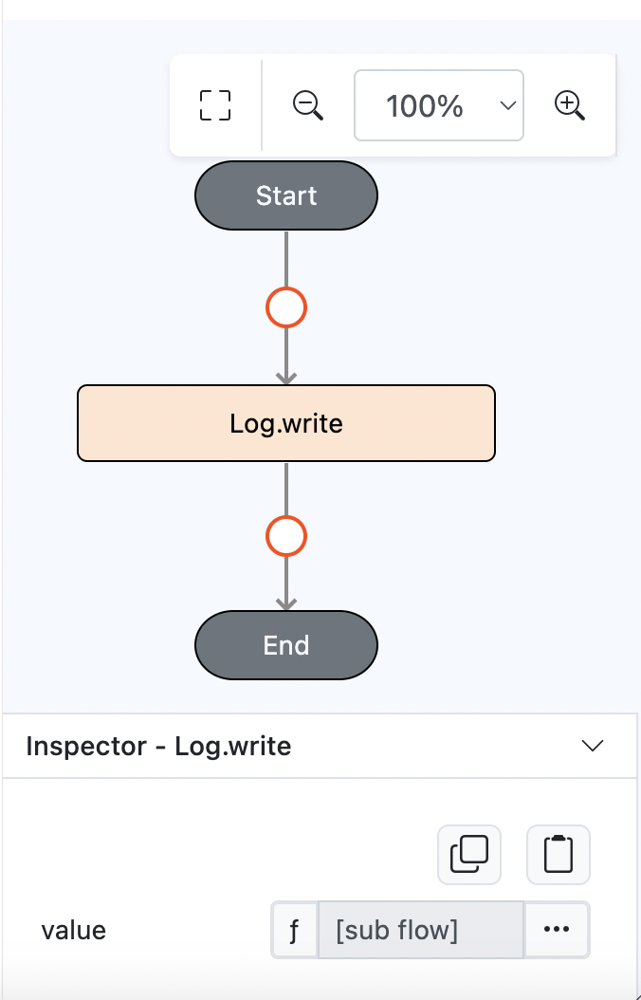
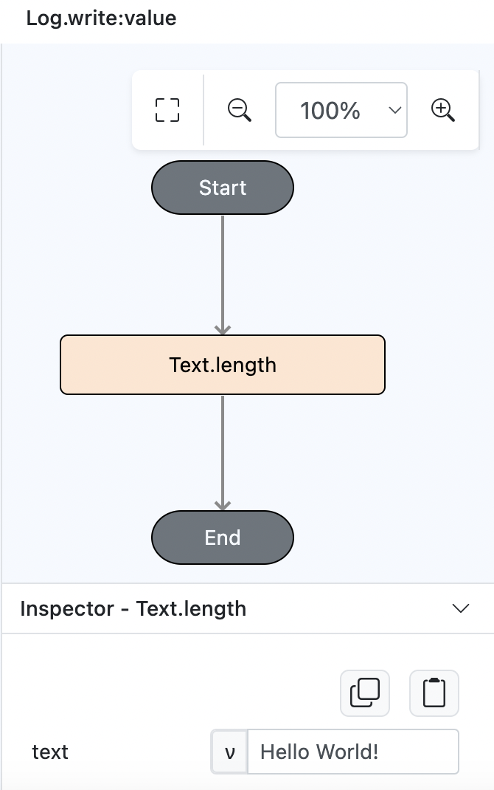
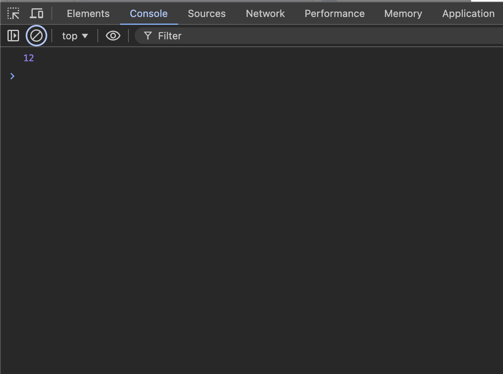

# Text.length

## Description

Counts the total number of characters in the text.

## Input / Parameter

| Name   | Description             | Input Type | Default | Options | Required |
| ------ | ----------------------- | ---------- | ------- | ------- | -------- |
| text   | The text to be counted. | Text       | -       | -       | Yes      | 

## Output

| Description                | Output Type  |
| -------------------------- | ------------ |
| Returns the total length.  | Number       |

## Example

In this example, we will count the total of a string.

### Steps

1. Drag a `button` component into the canvas and open the `Action` tab. Select the `press` event of the button.
    

        
    

   
2. Add `Log.write` function and add a subflow on it's value.

    

        
    

3. Then put `Text.length` inside it and fill the text "Hello World!"

    

        
    

### Result

1. The console will return the total length of text.
   
    

        
    
