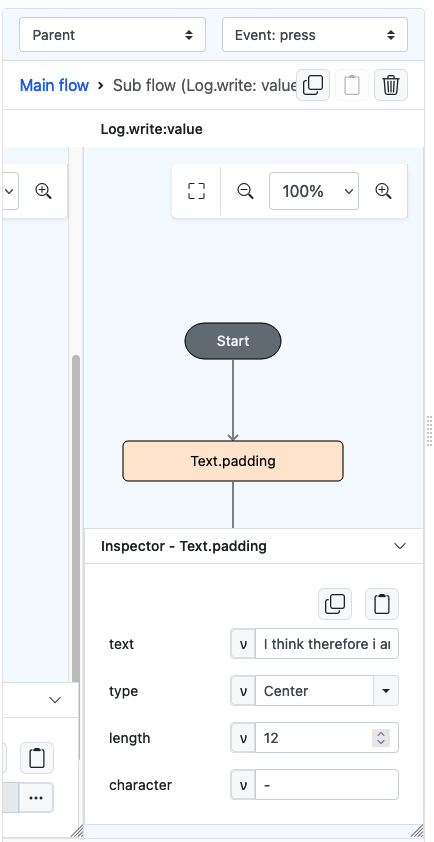
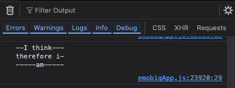

# Text.padding

## Description

Generates a padded text.

## Input / Parameter

| Name      | Description                 | Input Type | Default | Options             | Required |
|-----------|-----------------------------|------------|---------|---------------------|---------|
| text      | The text to be padded. | Text       | -       | -                   | Yes     |
| type      | The location of the ‘text’ within the padded string.  | Text       | Right   | Left, Center, Right | Yes     |
| length    | The total length of the padded string.   | Number     | -       | -                   | Yes     |
| character | The value to use as padding.     | Text     | -       | -                   | No      |

## Output

| Description                         | Output Type |
|-------------------------------------| ------ |
| Returns the new padded text.  | String/Text |

## Example

In this example, we will try to apply padding on a long text

### Steps

1. Drag a `button` component into the canvas and open the `Action` tab. Select the `press` event of the button.
2. Add `Log.write` function and add a subflow on its value, then put `Text.padding` inside it. Fill up the parameters accordingly.

    

        
    

### Result

1. The console on preview will show the padded text according to the previous setting.

    

        
    

## Links

### Related Information
