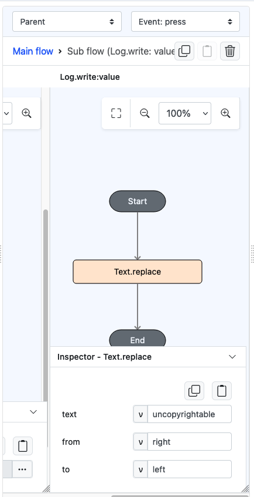
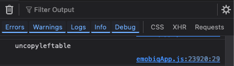

# Text.replace

## Description

Locates a specific set of characters in a string of text and substitutes it with something else.

## Input / Parameter

| Name      | Description                 | Input Type | Default | Options | Required |
|-----------|-----------------------------|------------|---------|---------|----------|
| text      | The text to be updated.  | Text       | -       | -       | Yes      |
| from      | The value to be replaced.   | Text       | -       | -       | Yes      |
| to        | The value to use as a replacement.    | Text       | -       | -       | No       |

## Output

| Description                         | Output Type |
|-------------------------------------| ------ |
| Returns the updated text.   | String/Text |

## Example

In this example, we will attempt to replace the occurrence of a word within a text with another word

### Steps

1. Drag a `button` component into the canvas and open the `Action` tab. Select the `press` event of the button.
2. Add `Log.write` function and add a subflow on its value, then put `Text.replace` inside it. Fill up the parameters accordingly.

    

        
    

### Result

1. The console on preview will show the changed text after replacement.

    

        
    

## Links

### Related Information
