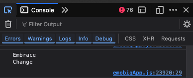

# Text.specialCharacter

## Description

Insert special characters in a string of text.

## Input / Parameter

| Name | Description                 | Input Type | Default | Options                                                   | Required |
|------|-----------------------------|------------|---------|-----------------------------------------------------------|----------|
| type | The type of special character to insert.   | Text       | -       | Carriage_Return, Escape, Horizontal_Tab, Line_Feed, Space | Yes      |

Options are as follows:
  - Carriage_Return
    - Control character. ASCII code 13. 
  - Escape 
    - Control character. ASCII code 27. Similar to pressing ‘esc’ key 
  - Horizontal_Tab 
    - Control character. ASCII code 9. Similar to pressing ‘tab’ key. 
  - Line_Feed 
    - Control character. ASCII code 10. Similar to pressing ‘enter’ key. Marks the end of a line and the beginning of a new line. 
  - Space 
    - Printable character. ASCII code 32. Similar to pressing ‘space’ key. 

## Output

| Description                   | Output Type |
|-------------------------------| ------ |
| Returns the special character | String/Text |

## Example

In this example, we will demonstrate how to use special characters in a text operation.
  - As most special character is not visible, detecting it can be difficult. We will use it in conjunction with `Text.combine` to see its effect.

### Steps

1. Drag a `button` component into the canvas and open the `Action` tab. Select the `press` event of the button.
2. Add `Log.write` function and add a subflow on its value, then put `Text.combine` inside it. Fill up the parameters accordingly.

   - See `Text.combine` documentation for its usage.
   - For `text2`, add another layer of subflow, then put `Text.specialCharacter` with the `type` selected to `Line_Feed`.

    

        
    

### Result

1. The console on preview will show the text with the special character applied (as a new line or line break)

    

        
    

## Links

### Related Information
