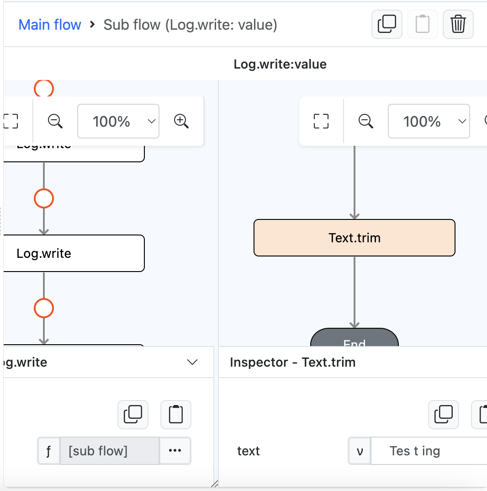
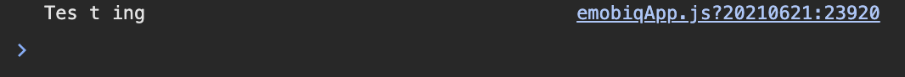

# Text.trim

## Description

Trim a string of text. 

## Input / Parameter

| Name | Description | Input Type | Default | Options | Required |
| ------ | ------ | ------ | ------ | ------ | ------ |
| text | The value to be trimmed. | Text | - | - | Yes |

## Output

| Description | Output Type |
| ------ | ------ |
| Returns the trimmed value.  | String/Text |

## Example

In this example, we will trim a text using trim function.

### Steps

1. Drag a `button` component into the canvas and open the `Action` tab. Select the `press` event of the button.
2. Add `Log.write` function and add a subflow on it's value, then put `Text.trim` inside it and fill text param with ` Tes t ing `.

    

        
    

### Result

1. The console on preview will show us the trimmed text value `Tes t ing` instead of ` Tes t ing `.

    

        
    

## Links

### Related Information